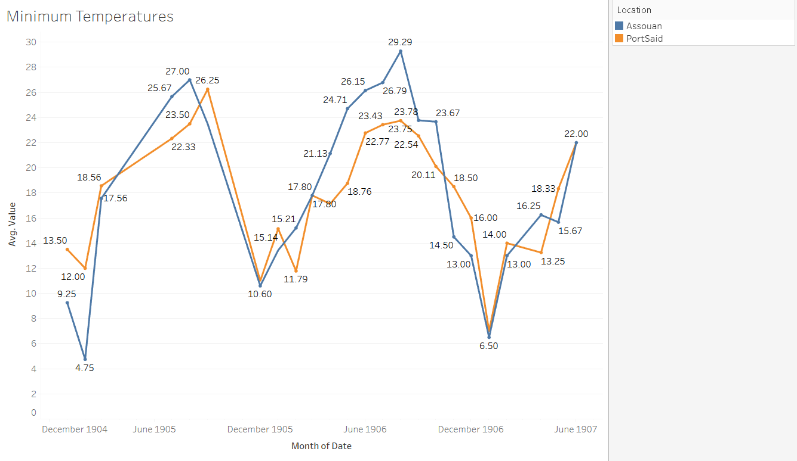

In this analysis project I analyzed the temperatures of Port Said and Assouan. Specifically, I gathered information about the maximum temperatures and the minimum temperatures. This data was pulled from the section titled ‘Daily Weather Report’ from within the _Egyptian Gazette_ newspaper. The section appears in almost every days’ issue and includes information such as the highs and lows in the shade, the humidity percentages, and the rainfall totals of all the major cities within Egypt during the early twentieth century. With the information on temperatures that was pulled from almost every day from 1905 to 1907 I was able to analyze the trends in seasonal changes. I observed to see if there were days or weeks where temperatures were too high or too low, resulting in the possibility of work being postponed or the possibility of people getting sick. Outside sources and credits made this process more fluid and really assisted in gathering information about safety requirements within a work place and the dangers of being in extreme hot or cold temperatures for set durations of time.

The locations of Port Said and Assouan are the key points of focus for my research. Port Said is a city that is in northern Egypt and located on the Mediterranean Sea. On the other hand, Assouan is in southern Egypt, near the Nile River, and a part of the Sahara Desert. Both cities have vast differences in their climate and these differences are easily recognizable. For example, Port Said is on the coast of the Mediterranean Sea meaning that it gets a sea breeze unlike Assouan. The sea breeze provides outlets for more moisture content to build up in the area, causing the overall weather-like symptoms to be rather humid and seem hotter on some days than it actually is. Unlike Port Said, Assouan is located in the midst of a desert, meaning that the temperatures fluctuate during the day and night. However, the climate of Assouan is notoriously dry and hot. The Nile River does provide some moisture that can increase the humidity, making the temperatures seem like they are hotter than they actually are, and vice-versa with wind coming off the river making temperatures seem cooler and more bearable.

Another locational difference that stands between the cities of Port Said and Assouan is the Tropic of Cancer. The line serves as a peaking point for the sun during the summer months in the northern hemisphere. On June twenty first of every year the sun appears directly overhead of the Tropic of Cancer marking the initial point and start of summer. The southern most city of the two, Assouan, is directly in the path of the sun during this time. The Tropic of Cancer is located on the latitude 23.5 degrees north, and Assouan is on the latitude 24 degrees north. In addition to being in the path of the Tropic of Cancer line, Assouan is also closer to the equator than Port Said is. When drawing a direct line that connects the two cities the distance between them is four hundred ninety-eight miles, or eight hundred one kilometers. This concludes that Assouan is nearly five hundred miles closer to the equator than Port Said is. For a better grasp of understanding on the distance I’ve included a comparison on distance from two cities in the U.S. From Miami, FL to Charleston, SC it is a direct distance of 485 miles. If you are a native of the Southern region of the United States or have ever travelled to Miami and Charleston during the peak of winter and summer, you know how different these climates and seasonal temperatures are.

In addition to differences in climate and seasonal changes, the data that I collected and observed for Assouan and Port Said were fairly different from one another. To show the data that was collected and then evaluated based on several averages I made two graphs. One graph is composed of the average maximum temperature for each month that the data was recorded for, and the other is the same, just with the average minimum temperature. Note that all the temperatures within ‘The Daily Weather Report’ were recorded in Celsius and not Fahrenheit.

Looking at the graphs, you can see that there are numerous spikes within the data. The spikes occur around the month of July, and the month of January both for the maximum and the minimum temperatures. The maximum temperature spikes for Assouan are around forty to forty-three degrees Celsius. Meaning that the maximum average temperature for the month of July in all three years was 109 degrees Fahrenheit. The minimum temperature spikes for Assouan are around twenty-seven to thirty degrees Celsius. Meaning that the minimum average for the month July was eighty-four degrees Fahrenheit. That is a fluctuation of about thirty degrees per day, which is very common all around the world.

The maximum temperatures for Assouan in the month of January averaged at about twenty-three degrees Celsius, or seventy-three degrees Fahrenheit. The minimum temperature for Assouan in the month of January averaged at about eight degrees Celsius, or forty-six degrees Fahrenheit. This once again is about a thirty-degree fluctuation in temperature throughout the day.

If we look at the spikes that occur in the data for Port Said they are around the same times as those of Assouan. This means that the two cities have roughly the same seasonal patterns. However, they are in different climates and that is totally recognizable from the data that was collected. Over the three years that we have data from, the average maximum temperatures for the month of August was around thirty-two degrees Celsius, or eighty-nine degrees Fahrenheit, and the minimum was around 24 degrees Celsius, or seventy-five degrees Fahrenheit. As for the winter months we’ll be looking at the month January. The average maximum temperature over the three years for January was seventeen degrees Celsius, or sixty-two degrees Fahrenheit, and the minimum temperatures were about five degrees Celsius, or forty-one degrees Fahrenheit.

In conclusion, this data sums up that the average annual temperature for Assouan is much higher than Port Said. During the beginning of the summer months Assouan is hottest. This is because of the location in comparison to the Tropic of Cancer. During the middle of winter months Port Said is coldest. This also has to do with their location in comparison the Tropic of Cancer, but more so due to the equator.

Additionally, in The _Egyptian Gazette_ we can read about the things that people did for enjoyment, work, and many other things. In particular, we are able to analyze that during the summer months people often left Egypt to go elsewhere. When reading the newspaper, a reader can see a plethora of advertisements having to do with ships leaving and/or returning. A huge sum of these ships leaves during the hottest time of year, and it is no coincidence. Work is abandoned in the summer months and people go off for vacation. This isn’t the case in the winter months because the average daily temperatures were extremely comfortable, and barely dipped below forty degrees, and barely peaked any higher than seventy-five degrees. To see why work might have been abandoned during the summer months in Egypt I did some research about the possible side effects of working in extreme temperatures.

There are many plus sides to working year-round, but there are also factors that put people at risk. Working in the extreme heat increases the likelihood of developing heat stress. Heat stress can occur from being out in the heat for too long, working at a high rate, or wearing the wrong type of clothing. The effect of this is the body trying to regulate its temperature and ultimately starting to fail. Resulting in dehydration and nausea. This is a huge reason why work load was put off in Egypt during the summer months, especially in cities that were closer to the Tropic of Cancer, and the equator. In cities like Assouan there are recorded temperatures exceeding one hundred degrees Fahrenheit. These are not suitable working temperatures and working in these environments can lead to exhaustion and even death.

Furthermore, the body’s set point temperature is ninety-eight point six degrees Fahrenheit. Whenever the temperature outside or in the working environment exceeds or goes below this temperature, the body is trying to cool, or obtain heat. In today’s modern time we have technology that allows us to see what the current temperature is at all times. This includes temperatures with or without a heat index to get the ‘feels like’ temperature. However, in early twentieth century Egypt there weren’t weather instruments that were accurate enough to constantly check the weather and its symptoms. All that was given was the daily maximum and minimum in the shade, so there was no way to tell what the ‘feels like’ temperature was. This could’ve resulted in occasions where people suffered heat stroke and other heat related symptoms because they didn’t know what the actual temperature outside was.

Reading through the _Egyptian Gazette_ will give you abundant information about Alexandria, the neighboring cities, and Egypt all together during the early twentieth century. As an historian, reading the numbers that are provided in the daily weather report mean next to nothing. However, comparing cities within the report with the help of modern information allows for a better understanding of why the Egyptian community did certain things at differing times of the year. Assouan and Port Said are two of the most separated cities in Egypt and give insight on the conditions of life in Egypt during this time from an understanding perspective.     
