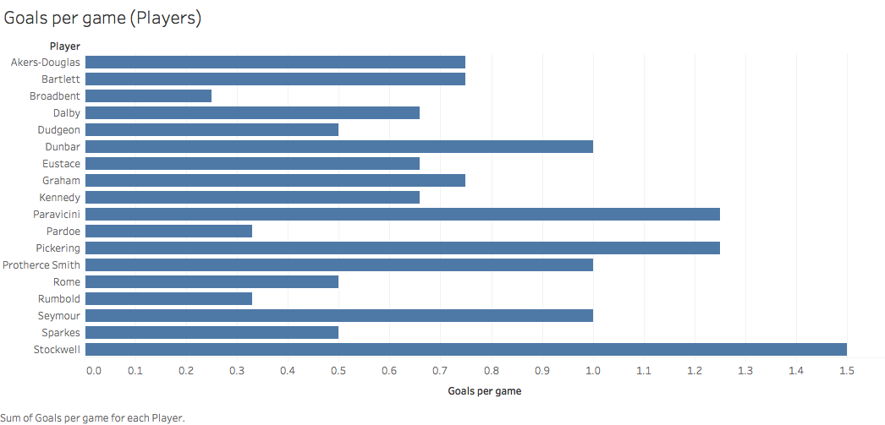
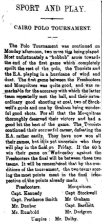
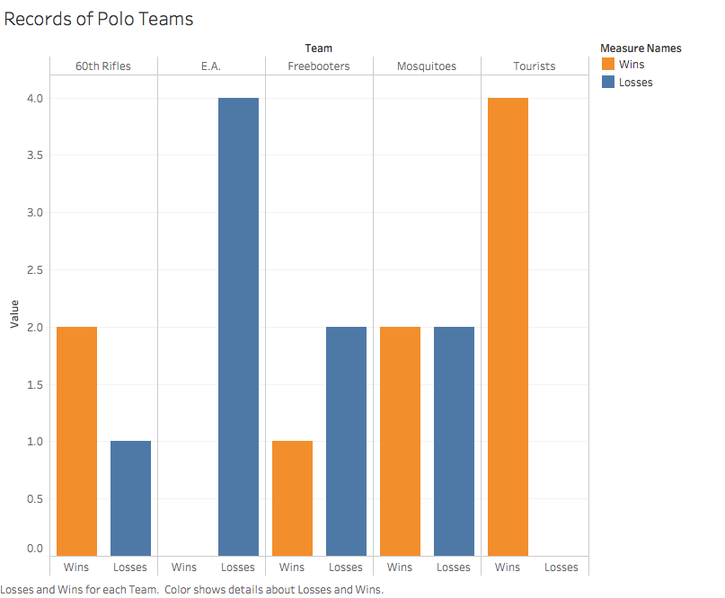

I chose to do my Analysis Project on the performances of different polo players and teams in Egypt and using different xpath queries and analysis to see who is the best polo player and the best polo team in Egypt. For this analysis, I will be searching through the editions of the 1905-1907 _Egyptian Gazette_ and determine which of the polo players and teams in Egypt have the better performances through those years.

While reading through my week of the _Egyptian Gazette_, which is March 5-10, 1906, I was always interested when it came to putting the ‘Sport and Play’ section together into xml formatting and I ended up reading most of the articles in that section. One of the headlines that would always seem to pop up for my week and interest me was the Cairo Polo Tournament. During the Cairo Polo Tournament and other polo games throughout the _Egyptian Gazette_, there are usually two games that are played on a given day and the days of the week that the Cairo Polo Tournament was being played were Monday, March 5th, Wednesday, March 7th, and Friday, March 9th, of 1906.

[Polo](https://www.britannica.com/sports/polo) is a game that is played on horseback between two teams, each who use mallets with long, flexible handles to drive a wooden ball down a grass field and between to goal posts. Before reading the articles about the Cairo Polo Tournament, I was uninformed about the [rules](https://www.historic-uk.com/CultureUK/The-Origins-of-Polo/) of polo and how it is played. Now, I am most informed about the sport and can understand terms that are being used in the articles about the games. Polo has aptly been called [hockey](https://www.jstor.org/stable/pdf/25485776.pdf?refreqid=search%3Af56393a29453dff0a4f76b5dc4efb7d2) on horseback. Each team usually consists of four polo players in each game and one umpire to regulate play of those games. The games are separated into four chukkers and whichever team scores the most goals at the end of the fourth chukker wins the match.

Most [historians](http://www.horsetimesegypt.com/pdf/articles/Polo_In_Egypt_Sport_Of_Kings_And_The_Kings_Of_The_Sport.pdf) of the sport consider that the game was first actively played as a cavalry exercise in Persia as early as the 6th century BC, migrating with conquest both east to China during the Tang Dynasty (7th century AD) and west to Byzantium, arriving in Egypt during the Ayyubid period (12th century AD). When I was reading through these articles, I wanted to know the context of these games, and which of the players and teams were really good and supposed to win and which of the players and teams weren’t as good as the other teams in the tournament. When thinking about what my analysis project should be, I immediately thought about this concept and was intrigued to find out more about the world of polo in Egypt.

To answer the questions that I had about polo teams and players, I composed and ran an xpath query in our main repository of the _Egyptian Gazette_ issues that were already put into xml formatting. The xpath query that I ran to execute this task is `//div[@type="page"][contains(., "chukker")]`. I used the word “chukker” as my search word because there are many times where the word “polo” shows up without their being an actual game. Whenever the word “chukker” showed up, there was always a game that was attached to the term. After I ran the xpath query and sorted in the repository to see where the polo games were in the _Egyptian Gazette_, I started to read the articles that consisted of those polo games in Egypt and find out which teams played in each game, how each of the teams performed that game, as well as their players, and who ended up playing the best.

Most of the polo matches and tournaments were found in the ‘Sport and Play’ section of the _Egyptian Gazette_, which was located on page five most of the time. The search for my query on the word “chukker” came back with 54 results, which was not as much as I thought it would be, but it is still enough to do analysis for this project. Most of the returning results from my query were from the first few months of 1906 and all of those results came from tournaments that were being played. The results of this query can also be hampered because of the fact that there are some issues that have not been turned into the main repository yet, or some students just didn’t correctly format when they were doing their xml coding. I think that if I had every issue from 1905-1907, correctly formatted and turned in to the main repository, I would have a lot more results for my query and more games that I can use for evaluation to see who ends up being the best polo player and team in Egypt.

After going through my results, I put together a bar graph showing the number of goals that were scored per game in all of the polo games combined by each of the teams that played, along with players that scored those goals each game. Out of the five teams that played polo in Egypt during this time, the Tourists is the team leading this category, scoring 4 goals per game. The player that had the most goals per game was Captain Stockwell, who averaged 1.5 goals per game. Stockwell plays for the Mosquitoes, who was second in this category with 3.25 goals per game. This gives a visual representation for not only which team scores the most goals per game in all of the polo games, but also which players score those goals each game for their teams and how many goals per game they have.

Although statistics are a big part of the research for my analysis project, it is not the only source that I will be using to determine who is the best polo team and player in Egypt. When I read through the articles that consist of polo games, I will see what the writer specifically says about each of the teams and the players and how they performed from his point of view, since he was there to watch all the games go down in 1906. I took down notes of what the writer said about each player and put those together with the statistics to figure out the best teams and players that play polo in Egypt.

Another one of my visualizations that I used is that I put together some pie charts with the number of total goals from each of the polo teams, along with their players on that team, and see which of the teams and players scored the majority of the goals in all of the polo games that were played. The Tourists were the team that scored the most goals, with a total of 16 goals, along with Captain Stockwell scoring the most goals from all the players on the polo teams, with a total of six goals. This gives a better representation of who dominates in scoring for all the polo teams and players in Egypt for 1906.

The data visualization charts that I used above are different because one shows the goals per game by each player and team, while the other shows the total amount of goals of the same players and teams. I decided to use both of these data charts because for the first one, it shows the players and teams efficiency in each game with the average amount of goals they score, while in the second one, it shows the total goals and who is the best overall scorer on each team and the best scoring polo team in Egypt.

The next data visualization that it shown is a multi-bar chart for the total amount of wins and losses each of the polo teams have throughout the course of all the polo games that are played. This shows, blatantly, which of the teams that have played are really good or really bad. From this chart, you can also examine, from the teams that have good win-loss records, that most of the good players that play polo are from the teams that have winning overall records in the polo games that they play. The Tourists have one of the best records in Egypt from all the polo games, with four total wins and zero total losses. One of the worst teams in polo is E.A., who have a combined zero wins and four losses.

In conclusion, through my xpath query results, along with my data visualizations and analysis research through the many polo game articles, I have found that the best polo team in Egypt is the Tourists and the best polo player in Egypt is Captain Stockwell. The Tourists have not lost a game of polo, with an undefeated record of 4-0, and Captain Stockwell, from the Mosquitoes, leads all polo players in goals scored and is thrived upon by the writers when he plays. Other great players that played polo in Egypt are Mr. Paravicini and Mr. Pickering, who both play for the undefeated Tourists and each scored five total goals from their polo games. Even though there wasn’t as much information for analysis as I thought there would be, the information that I gathered for research was still appealing and the game of polo in Egypt is something that the people who loved sports wanted to read in the _Egyptian Gazette_.
