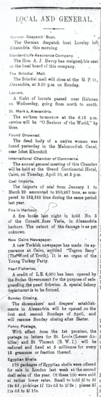

There were many topics to chose from pertaining to the _Egyptian Gazette_ however, in my analysis project I decided to look at the "Local and General" section of the newspaper. I was interested in the topics that showed up most in the section and moreover what topics kept getting printed in the issues of the newspaper. I wanted to know throughout the newspaper what topics were, not so much being read more than the other but, reoccurring actions to be talked or read about in Egypt during the time.

## Word Cloud Photo

As a result of this I decided to create a word cloud to make a visual representation of the headlines of each section of the newspaper. In the word cloud, the headlines that were printed most are the largest in the figure and then following that are the headlines that are posted less which are represented by the smaller words in the figure.

## Data
For this data set I created a query that would find only the headlines in the section of local and general and it would also include the date of the issue posted. I used two queries to do this because the `@feature` and `@element` tags were implemented and each contained data that I needed to combine to get accurate results. The first query used was as presented `//div[@feature="local"]/div/head`, the second query is different by one word `//div[@element="local"]/div/head` . The first query search returned 2,497 items while the second query resulted in 308 items. After this I transferred all the results into atom and refined the visual content that the search gave me. At the end I had two columns of data that was the date of the issue and the headline that was posted on that date in the "Local and General" section of the newspaper.

## Comparison and Outside Sources
Reading through other analysis projects from previous students, as well as the discussion of it in class, there was one that stood out to me about the Plague. As I was reading through their project they mention that their search for any `div` in any `item` would contain the word "plague" and it only returned 82 items. This search seems to have returned a small number of instances for the return of the word plague considering one of the more prominent words in my word cloud is the word "plague". They continue to go on to explain the way the word was used and the context of the word in the multiple occurrence in the _Egyptian Gazette_.

Also in relation to my analysis search I want to reference today's newspapers and/or ways of information in today's society. We hardly get our information from a daily newspaper anymore, we typically get our intel from either social media or from the form of digital news still found on the internet. There is the more common way of reeling in viewers with a headline that is either a hook or a brief excerpt of what the piece entails. This differs from the way the _Egyptian Gazette_ displayed its news. The headlines for the news paper in the section are 2 to 3 word headlines that explain the passage.

## Conclusion
The largest printed headline was the word "Canal" and the second most printed headline was "Suez". There were other headlines printed that were seen quite often throughout consisting of: Alexandria, Plague, Egyptian, Stray Dogs, etc. There were often topics that were repeated in this section of the newspaper and new information was displayed this way in the _Egyptian Gazette_.

Below is a clip of the newspaper that I would find the "Local and General" section in and it is typically found on the third page of the issue. Also, to conclude this analysis project I think that the way I represented this data works much better visually than any bar graph would have been able to.

