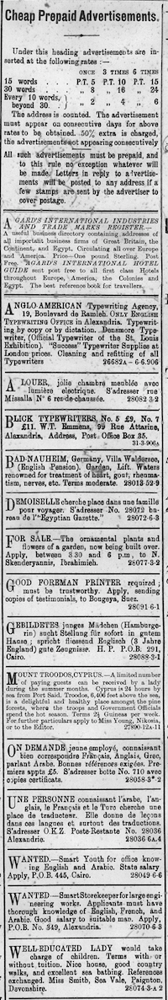

For my analysis project, I decided to analyze job advertisements in the “Cheap Prepaid Advertisements” section of the _Egyptian Gazette_. The specific contents of the job advertisements that I analyzed were the languages that employers wanted applicants to know, the expected gender of the applicants, and the adjectives used to describe desired applicants. In addition, I considered the amount of job advertisements that were present in different months during 1905 and 1906 to see if there were any noticeable trends.

I used an excel sheet to organize my data into five categories. I placed job titles in column one, the date of the issue in column two, gender mentioned in the advert in column three, adjectives used in column four, and languages required in column five. Overall, I found 129 instances of job advertisements in the issues I searched. I used the Xpath query `//div[@element="prepaidAdvertisements"]` to search my content folder. This brought up places where people used this element tag to describe an item or section. From there, I went through the results and put the data I needed from the job advertisements into my excel sheet. The Xpath query I used was very broad, but I had to use it because there was no way to search for specific job advertisements without yet knowing the names of different jobs. The one disadvantage of using this query is that some people might have put the “Cheap Prepaid Advertisements” section in their file without using the element tag. That said, I decided that my results would provide a good representation of job advertisements in the _Egyptian Gazette_.

Here is an example of the “Cheap Prepaid Advertisements” section in an issue of the newspaper:

The first way I chose to visualize my data was with word clouds. One word cloud represents the prevalence of different types of jobs in advertisements:

The top three jobs advertised make up over 50% of the advertisements overall. Looking at the word cloud, the most commonly advertised job was for a clerk. In order to organize my data, I did not separate each different type of clerk into separate categories. Among the advertisements for this type of job, many were for general clerks, while others were for typing clerks and office clerks. The Merriam-Webster dictionary defines a clerk as someone “whose job is to keep track of records and documents for a business or office." According to Robert L. Tignor in his book _Modernization and British Colonial Rule in Egypt_, clerical positions were normally held by people in the Coptic religious community prior to British colonial rule due to their clerical skills. This was especially true for clerical jobs in the government (Tignor 308). Such jobs became held by a wider variety of people during the period of British colonial rule. This happened because Egypt became more modernized during this time, which called for more advanced skills from those working as clerks (Tignor 308). Most of the job advertisements for clerks expected a wide variety of skills from applicants. Applicants were often expected to speak multiple languages, with some advertisements even expecting them to be fluent in five languages. The languages that seemed to be most important to employers were English and Arabic, with many advertisements mentioning that reading and writing these languages was an indispensable quality for employment.

The second most advertised job category was nurse. Many of the advertisements for nursing jobs mentioned that the position was specifically available to women. The word nurse was used to describe a caretaker for children in many circumstances, which is different from the common use of the word. Something interesting I found was that many families would put out advertisements to find a nurse to take care of their children for the course of a ship voyage.

A couple of jobs were only advertised once or twice. It was very interesting to see what kind of unique jobs there were during the time period. For example, one advertisement was for a position as a draughtsman who would make plans and drawings for the government. Another was for an organist to play at a church event. The frequency of advertisements for some jobs surprised me. I only found one advertisement for a blacksmith position, and I thought that it would be a more common job during the time period.

This graph shows the frequency of each type of job advertised:

<iframe src="https://public.tableau.com/views/Analysisproject/Sheet5?:showVizHome=no&:embed=true" align="center" width="90%" height="500"></iframe>

As I looked at each job advertisement, I wrote down if it mentioned a specific gender preference for applicants. I found that the majority of advertisements did not specify a gender. The only time women were mentioned in job advertisements was for nursing and child care positions. Men were mentioned for a variety of positions.

<iframe src="https://public.tableau.com/views/Analysisproject/Sheet2?:showVizHome=no&:embed=true" align="center" width="90%" height="500"></iframe>

I made a second word cloud to demonstrate adjectives used to describe what type of employee each advert was seeking:

Many advertisements sought young applicants. The adjective with the most occurrences was experienced. None of the adjectives stood out as unique. The advertisements mostly used generic words such as good, competent, and smart to describe the types of desired applicants. Jobs that involved child care often used the word caring. Education requirements were hardly mentioned in the advertisements. Only a few mentioned seeking well-educated applicants, and none mentioned specific types of education required for employment. The words used in the job advertisements were similar to self-advertisements in the same section, where people seeking employment would state their experience and qualifications.

An important feature that I analyzed was the languages potential employers wanted applicants to be fluent in. Some postings for seemingly simple jobs stated that they wanted applicants to know three or four languages, which was very surprising to me. Languages mentioned included Italian, German, English, French, and Arabic. Many advertisements mentioned that they wanted an Englishman.  There seemed to be no pattern to which types of jobs required fluency in the most languages. Most advertisements wanted applicants to know one, two, or three languages. Only a few required that they know four or five.

<iframe src="https://public.tableau.com/views/Analysisproject/Sheet1?:showVizHome=no&:embed=true" align="center" width="90%" height="500"></iframe>

Twenty more advertisements were found in 1906 issues of the paper than in 1905. June was the month with the most advertisements. Looking at a graph of the amount of advertisements over time, there seems to be no pattern to the amount of advertisements during different times of the year. It is hard to tell whether or not there would be a clear pattern if I was able to use a broader Xpath query to get more results. However, such a query would produce too many results to sort through.

<iframe src="https://public.tableau.com/views/Analysisproject/Sheet4?:showVizHome=no&:embed=true" align="center" width="90%" height="500"></iframe>
