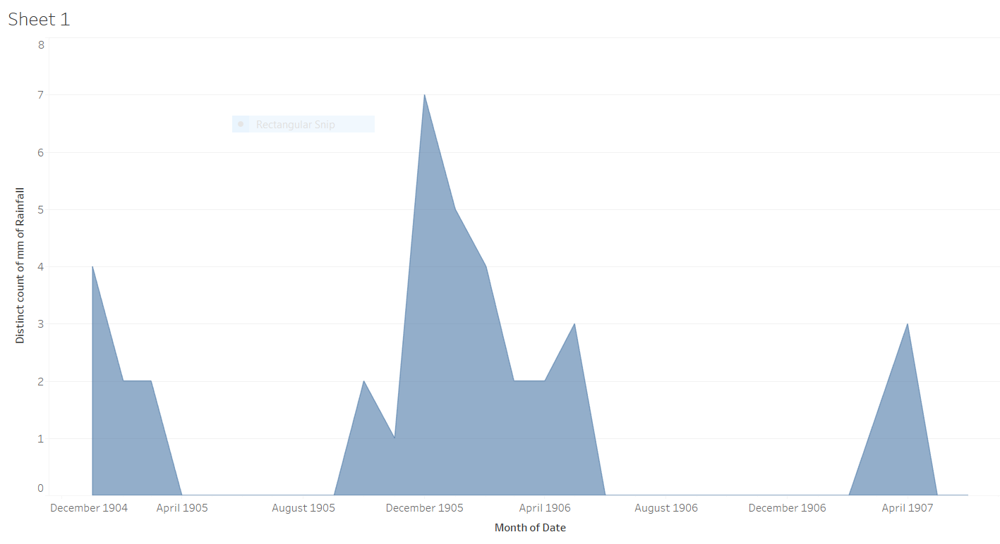

Microhistory gives the ability to focus on smaller details in history to be able to fully understand why and what happened during that day in time. Microhistory for this class allowed the students to investigate the _Egyptian Gazette_ newspaper from 1905, 1906, and 1907 and see details from our certain weeks assigned to us. The week that was given to me was the week of June 17th, 1907. After analyzing six days of this newspaper, we start to see similarities and patterns in the paper overtime. Each day has around six to eight pages and while each page is different, each page of each day has a similar format with different topics. Page one consisted mainly of ads which were pretty much uniform throughout all of the days for my week. Page two has some adds mixed with some text. The page threes are mostly text. They all start with “Local and General,” then the “Financial Crisis,” and then articles about what is happening at the time. Page four mostly consists of charts full of data, ranging from cotons to stocks and shares. Page five is more information about what was happening in their society at the moment. It has two columns of telegrams, a daily weather report, and usually a story highlighting a specific person. Page six continued with more ads along with ads that would normally go on flyers and some data. The daily weather report on page five is my main focus for this assignment.

After downloading a copy of the master content from GitHub, I used it to isolate the daily weather report from the deliverables. Using the daily weather report I wanted to find out all of the inputted values for the amount of rainfall every month for every year. After retrieving the values, I could not fully complete the graph that I wanted to have consisting of months, years. The reason behind it is because some of the data consisted of “Heavy Dew” for some records rather than a number of how much rain. Because it is a text and not an exact amount, the graph could not show the amount of rain each month for each year. However, I computed a graph that shows and added amount of rainfall for the month. There are some months with no rainfall because it did not rain, and it is recorded that it did not rain that day. The day that it rained the most is undetectable because there are two entries of “Heavy Dew” which could be a larger number, we do not know.

In analyzing how much rainfall there was over time, after looking at the graph, we can conclude that there was only recorded rainfall for fourteen out of the thirty-six months. After going through a majority of the files to be sure that the data for the rainfall daily was correct, I also chose to read the information under the “Remarks” tab regarding the weather for that particular day. Doing this give me a look to be sure that the value entered is correct. I can determine this because if a value is recorded as no rain for that particular day, but the remarks for that day says that there was heavy pour or “dew”, then I know that the data is incorrect. While I did not read through all of them, because there are an awful lot, I read through one every other Monday. I chose to do it like this because it is easier to stick to one certain day to look at rather than switching days and getting mixed up.

The graph above shows the amount of rainfall from 1905 to 1907 each month. The months that have no data are crammed together and not shown because there is no recorded date for those days or months. For the graph, the average rainfall cannot be shown because all of the entered values are not all numbers so the graph can only show the amount of times that it rained every month. After working with Webber in office hours, we came to the conclusion that there was no other possible way to retrieve that data for average rainfall and that the only possible solution was to record the data for how many times it rained per month per year. Using the daily weather report data, not only rainfall for the day is shown. It also consists of direction of wind, maximum temperature, and humidity level for the day, etc.

This graph displays the amount of rainfall per month in hundredths of a mm. The difference between the two graphs is that this one disregards the values that say "Heavy Dew" and only focuses on the numerical values that were inputted.

The reason that I chose doing a graph using the data of rainfall recorded in the _Egyptian Gazette_ for all three years is because I favor the rain. There is no special reason that has to do with my major or what I am interested in, it is simply because I enjoy the rain and I was curious to see how often it rained in Egypt during this time.

In order to obtain a graph of the amount of times it rained per month per year in Egypt, I first had to search in the master content folder on my hard drive. The XPath query that I used to get these results is `//cell[contains(.,"Rainfall")]//following-sibling::cell/measure`. Doing this, I was given back the days and values inputted for rainfall each day in the newspaper. The XPath that I used tells Oxygen XML Editor to first look in the second level of cells that contain “Rainfall” and to then to look into the measure to see what the value is. After 73.3 seconds, the XPath came back successful, returning the inputted values and dates for which it rained daily. The data is formatted that each value is measured in millimeters and every “null” value was recorded as no rainfall for that day. The “Heavy Dew” description imputed for the value of rainfall cannot be considered a number because it is unknown how many millimeters “Heavy Dew” can account for. After getting the information from Oxygen XML, I used Atom to take out the information that I did not need to use and took everything out except the date and amount of rainfall for that day. Then, using Tableau, I uploaded my data into the software and computed a graph of how much is rained every month from 1905 to 1907.

The strengths and weaknesses of using the content folder of the information from the _Egyptian Gazette_ can cause problems or be extremely helpful. A weakness about using the master content folder to search through and pull information from is that it is information put into the document by persons, so it is not 100% accurate if even one person did it wrong or left out information. A strength of the content information is that all of the information and data is in one large file that can be searched through completely. Another weakness is that not only could the information be wrong, but there could be information left out of the documents. Whomever transferred the information from the newspaper to the content folder could have left out certain numbers, ads, or articles. When it comes to searching for something, if it is left out of the file, then the information is not there to be found. For example, while searching for rainfall for every day, if someone who was entering the information for May 8th forgot to change the value of rainfall from 0 to 2 mm, then my data is inaccurate based on how much it actually rained that day. Therefore, whatever documents are changed by a person need to be trusted that the information updated is correct information.

After looking at the project titled "[Making Sense of the Daily Weather Report](https://dig-eg-gaz.github.io/analysis/2017/vaverek-analysis)," I looked through the picture that they used, and in this certain one, there was no section for rainfall. There are multiple cases where this occurs. Some of the newspaper issues do not have rainfall in the daily weather report. This could be because it did not rain that day. However, there are multiple times that it is labeled in the paper with a value showing that there was no rain for that day. So the question that arises is, why do some days not have the rainfall tab in it?

Finding an external source, I also looked at the website [oldweather.org](oldweather.org) to see if there was any information about rainfall during 1907 and the earliest dates that I could find weather reports on were from 1913 to today. I searched the website for any information regarding 1905, 1906, and 1907 but no information surfaced.
