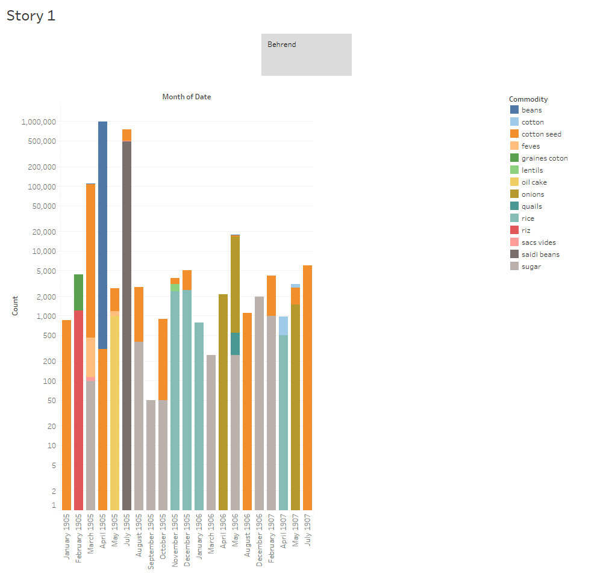
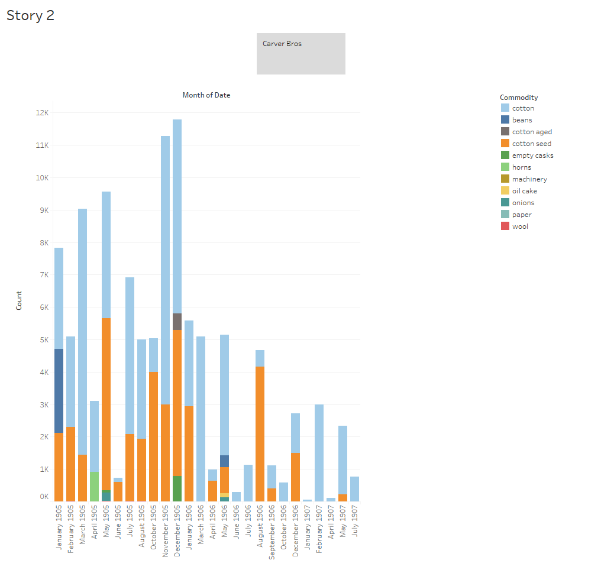

My analysis project focuses on two companies that ship goods from Egypt to England. They are Carver Bros Company and Behrend Company. I will compare and contrast the goods that each company exports as well as their levels of success. I am analyzing data from the full content available to me from the _Egyptian Gazette_, meaning these results range from January 1905 through July 1907. I will also use them to exemplify the Egyptian export industry based off of research I have collected.

## Steps Taken Towards Completion and Problems in the Way
### 1. Query:
While coding the _Egyptian Gazette_ in XML I found an interest in economic topics, such as imports and exports. I wanted to know what goods were being shipped in and out of Egypt and what countries they were coming from and going to. Therefore, I figured it would be useful to use the data from the "Export Manifests" section. I tried using the xpath query `//div[@feature="exportManifests"]` but a very large majority of the results were un-updated templates that had just been copied and pasted. So, with Weber's help, I came up with a new query using regular expressions. In "text to find" I searched for `behrend.+` and then restricted it to `//div[@feature="exportManifests"]`. I did the same for Carver Bros. This gave me a unique set of results for each company that I could work with.

### 2. Results:
This is where I experienced the most difficulty. After copying and pasting the query results into Atom and cleaning it up using regular expressions I could not get my results to paste into Tableau for some reason. One of the companies worked fine, but the other would only paste as a single column instead of separating the data into a table. After some trial and error, Dr. Hanley was able to help produce results that could be transferred to Excel and then to Tableau.

### 3. Visualizations:

## Analysis
Before doing research on scholarly articles having to do with Egyptian exports, I tried to find any additional information on these two companies within the _Egyptian Gazette_. I did a query for "behrend" and "carver bros" in `//div[n="3"]` but none of the results were very fruitful. The only results for "behrend" had to do with a rice mill owned by someone of the same name. Perhaps it is the same person, or maybe a relative. For "carver bros" the query returned results with information about the office of Carver Bros being a meeting place for the 'British Chamber of Commerce of Egypt.' It was also referred to as "a great cotton house." Based off this limited information, I would hypothesize that Carver Bros was a larger and more successful company than Behrend.

Based off of my results and my visualization, I can see that Behrend company exported fourteen products, while Carver Bros only exported eleven. If one were to simply look at the visualizations, one could make the assumption that the total amount of exports is about the same, since majority of the exports for both companies fall between zero and ten thousand units. However, concluding this would be innacurate because the unit type for each product is different. For example, cotton is sold in "bales" but cotton seed is sold in "tons." Other things, such as onions and sugar, are sold in "bags." Since it is unknown what constitutes a "bale" of Cotton or a "bag" of sugar, it makes comparing products difficult. Due to Behrend Company exporting an immense amount of beans, it caused outliers on the graph. I still want to include the data for beans since it is one of the products that both companies exported, so instead of excluding the outlier I changed the y-axis of the Behrend graph to a logarithmic format to make the graph more readable.

In comparing specific products, I will focus only on those that are shared between the two companies. These include cotton, cotton seed, beans, oil cake, and onions. Most of these products are shipped several times per year, however I find it fascinating that the Behrend company only shipped beans one time throughout the whole span of January 1905 to July 1907. Not only were beans exported only once, but it was the biggest shipment from the Behrend company in that entire two and a half year span. This makes me wonder if beans could only be harvested and shipped one month out of the year (April, in this case) or if London had another, more valuable, source of bean imports.

It is easy to tell by looking at the visualizations that Carver Bros is largely a cotton company, with its main two exports being cotton and cotton seed. Although it out-exported Behrend in cotton itself, Behrend actually exported much more cotton seed than Carver Bros.  Carver Bros also only sold 384 units of onions and 126 units of oil cake, compared to Behrend's 19,997 units of onions and 996 units of oil cake. Based on looking at these visualizations and analyzing the data   one could conclude that Behrend was a much more diverse and probably more successful company. Behrend not only exported more total products, but also exported more different types of products.

So how do these two companies exemplify the bigger picture of the economic world in the early twentieth century? In "Europe and the Maritime World" author Michael B. Miller notes that the first half of the twentieth century's global economy was largely shaped by "the conquered territories of Africa and Asia" that had been colonized in the nineteenth century. He says that even though most trade was still conducted between the major western powers, "commerce with formal or informal empire accounted for a very considerable share of the 'global' in global exchange" (Miller 2012). Both Behrend and Carver Bros were companies that shipped out of Egypt, which was a colonial territory of Britain at the time. From a micro-historical perspective, these companies seem very large and important, however Miller also notes that London was the top European port until about the 1950s. Both of these companies shipped to London, but they were just two of many.

In "Agrarian Change and Industrialization in Egypt,1800-1950" author Peter H. Bent leads the reader to believe that the early twentieth century was a time of economic prosper for Egyptian exports. He claims that the nineteenth century was characterized by the harsh rule and failed industrialization attempts by Muhammad Ali and that Egyptian industrialization was not successful until British rule in the early twentieth century. However, he states that Britain only facilitated industrialization in Egypt for certain purposes, specifically cotton production. In addition, he adds that Egyptian exports were largely affected by the Great Depression, so based off this research I would assume Behrend and Carver Bros, among other Egyptian export companies, were at their height during the first decade or so of the twentieth century, which is the period of micro-history that we have been studying this semester.
