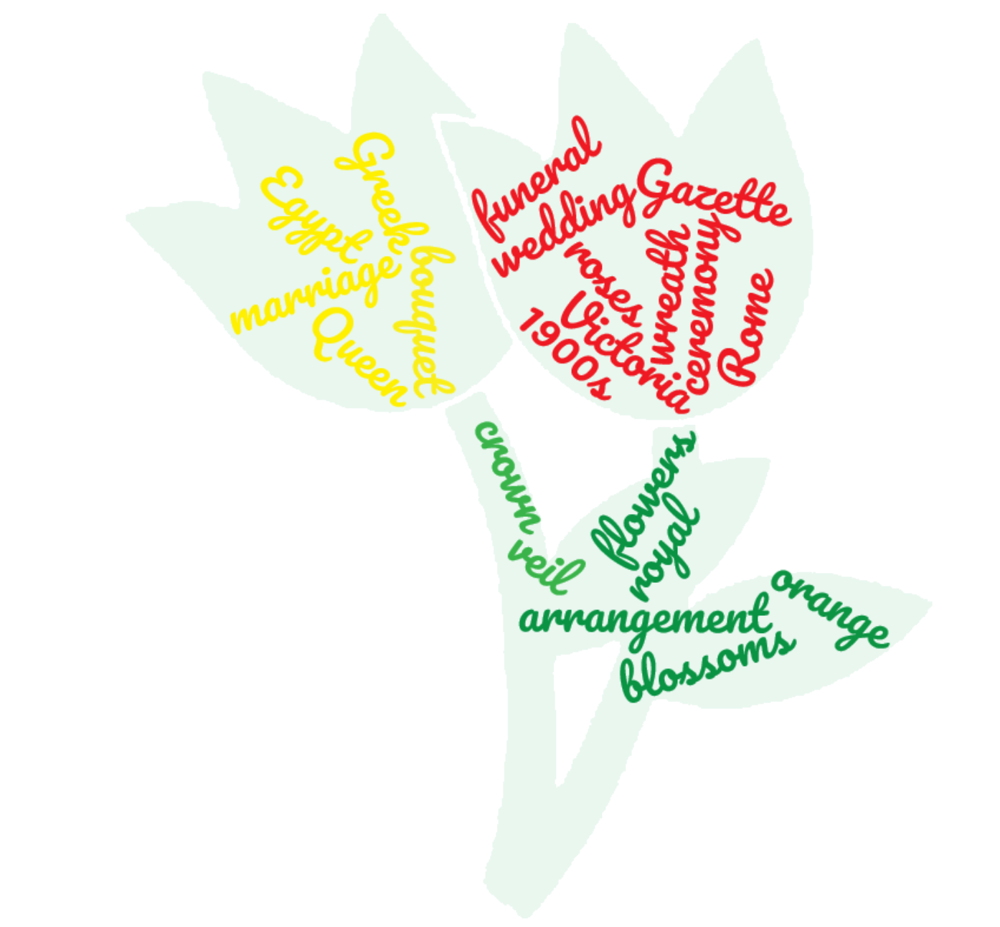

I wanted to see similarities between funerals and the type of arrangements mentioned in the articles. I took notice of the date these weddings were happening, and if orange blossoms were used. I did research that showed during the 1900s orange blossoms and myrtle flowers were very popular in royal weddings.

## Topic
Looking through issues of the _Egyptian Gazette_, I found many features about weddings and funerals. I was interested to see if trends were popular during certain seasons during 1905 and 1906. Having a wedding announcement in the newspapers may also require a position of authority. I became interested in the trends that may also carry over to weddings outside of the Alexandria and Cairo area.

## Importance
> *Finding information about _Queen Victoria’s_ wedding in the mid-1800s, showed that she had a crown of orange blossoms, which started a trend into the 1900s. Royal weddings are always of interest to people reading in multiple different countries. I also found information about orange blossoms and their role into Chinese wedding celebrations. “There are few trees so prolific as the orange; it is one of the rare that blooms and bears fruit at the same time, thus becoming symbolic of fruitfulness. During the Crusades, the custom was brought from the East first to Spain, then to France, then to England in the early 1800s.”*
- (Victoriana.com)

## Interested
Wedding have always been of interest to me because they are such a happy celebration. Flowers are also one of my favorite things, I love to look at them and help my mom with the garden at home. In present times flowers are a focal point for weddings

## X-path
I started by looking through the entire repository with the keywords *“wedding”* and *“flowers”*. However, these findings weren’t the most focused or helpful. I then tried using *“marriage”* and was able to find more articles with descriptions of the wedding ceremonies. Upon talking to Professor Hanley, we decided to also look for funeral information. I then searched for *“funerals”* and looked through the articles for flower arrangements. Once I found specific articles I was planning to use, I also searched for *“orange blossoms”* to see what results came back and see if they corresponded to articles I had already found.

## Process
While doing x-path queries it was fairly simple as far as finding articles, and then narrowing down my results. When first using the term *“marriage”* there are over six hundred results, however upon looking through them it is easy to see they don’t fit the article type I need. Some of these articles simply talk about advertising for marriages, deaths or illnesses, and other simply say that a marriage occurred. Using *“wedding”* narrowed the result to one hundred and forty-three articles, which offers a lot better descriptions on the ceremony and decorations. “Orange Blossoms” brought back ten results that were the most helpful in this analysis project. On the opposite side, *“funeral”* brought up a fair amount of results, two hundred twenty-four, which had a mix of good and bad articles. Again, some simply talked about funeral advertisement space, and others gave information about services. The search that gave the most confusing results, was *“flowers”* this is such a common word that it comes up in battles, market shops, and as names. I decided to specifically look at orange blossoms instead of the generic flower.

## Results/Difficulty
I found over one hundred results for both weddings and funerals. Some of these instances had the flowers specifically named or how they were arranged, but the majority didn’t mention either.

<iframe src="https://public.tableau.com/views/FuneralsandWeddings/Sheet1?:showVizHome=no&:embed=true" width="90%" height="500" ></iframe>

## Conclusion
There was not any direct correlations between the date of the weddings and if they had orange blossoms.

## Quotes

*“One remarkably consistent usage was the symbolic meaning of “Chastity” attached to orange blossoms. Queen Victoria elected to wear orange blossom- her only floral adornment- at her marriage to Prince Albert on 10 February 1840."* -[https://www.royalcollection.org.uk/collection/65305/headdress-from-the-orange-blossom-parure](https://www.royalcollection.org.uk/collection/65305/headdress-from-the-orange-blossom-parure)

*“Orange Blossoms are also popular in other countries around the same time. Garlands and crowns were used in Greek weddings, that included olive branches and herbs, as well as white flowers and orange blossoms, which stood for sweetness and happiness.  Rome couples followed a similar custom to Greek wedding flowers, weaving greenery and blooms into garlands and crowns, scented with orange blossom, roses, thyme and basil which wards off evil and"* -[https://weddings.lovetoknow.com/wiki/History_of_Wedding_Flowers](https://weddings.lovetoknow.com/wiki/History_of_Wedding_Flowers)
