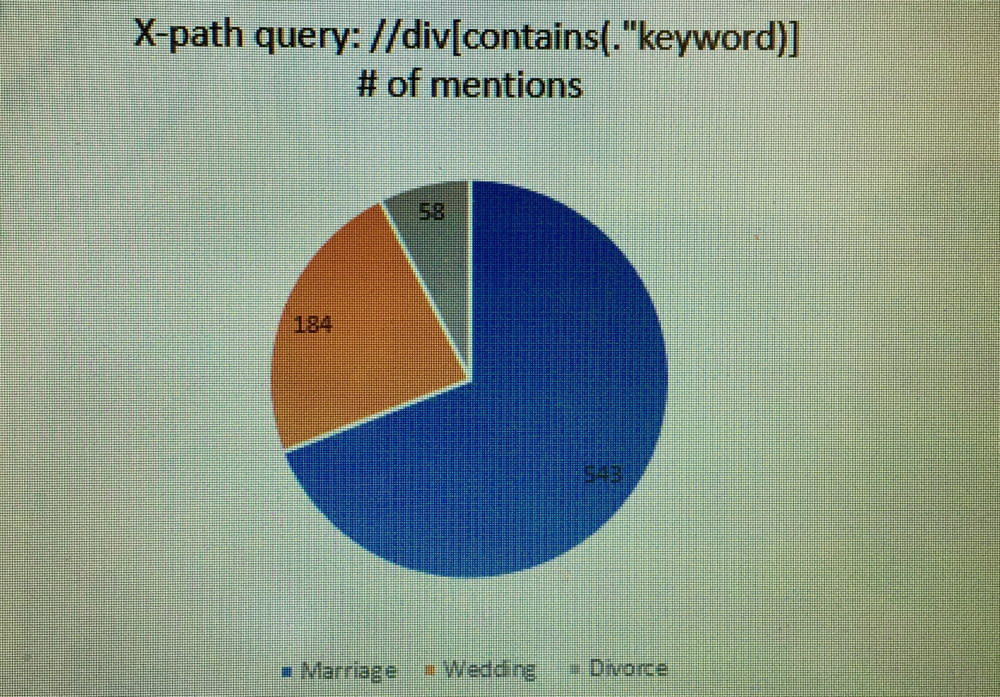
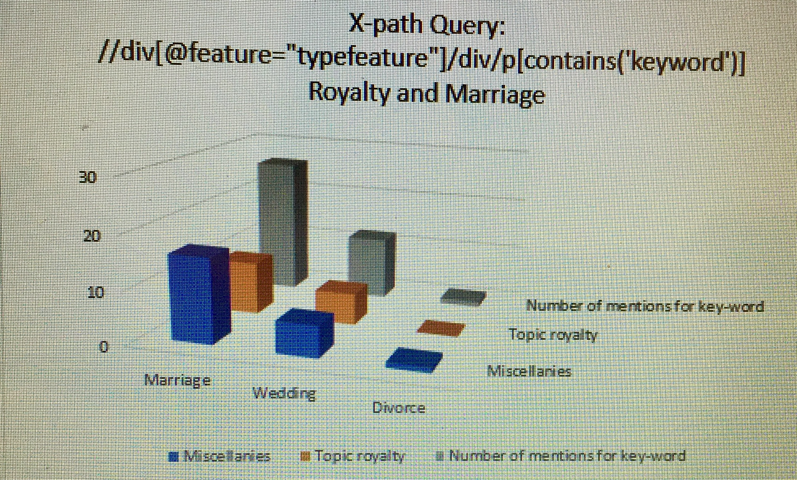

My inspiration for this Analysis project began with my blog post. When looking through my page images for the _Egyptian Gazette_, I came across something that really peaked my interest, “A Prison Wedding”. This directed my attention towards unions during the times the newspapers were published. I was curious to discover trends in marriage during this time-period to divulge whether prison marriage was a societal norm. It’s not every day in today’s society that I hear of a convict being married in secret to a prison guard’s daughter, and accusingly by the prison guard nonetheless! My goal was first to find who the _Egyptian Gazette_ was reporting on getting married. I wanted to find whether there were trends in the demographics of those being reported on. To truly give an accurate analyzation of the demographics and marriage during the time, I felt that I must also analyze weddings and divorce. I chose those two words because they closely correlate with marriage and there could be articles discussing marriage that don’t mention the word marriage, and that mention the words wedding or divorce. So, I began by searching for each of those three key words one at a time, marriage, wedding, and divorce. The query I used to search for each word was, `//div[contains(.,”keyword)]`. This query gave me results on all dividers that contained the word I entered in the spot “keyword.

Using the basic query, there were a very high number of mentions for the word marriage (543), less than half of that for the word wedding (184), and the lowest number of mentions for divorce (58). I found that while not many articles that mentioned the word marriage used the word wedding, a large amount of the articles including the word wedding did include the word marriage. Though these two words had correlation, articles mentioning divorce rarely spoke of the words marriage or wedding.

Due to the large number of mentions, I had to find a way to narrow down my results. The first step I took to narrow down these results and begin to analyze the demographics behind marriage in the _Egyptian Gazette_, was developing a typology for the articles mentioning my key words. I noticed from skimming through each of my my prior searches that my key words all seemed to appear in the same types of features. These reoccurring features included local, social, wire, notesPortSaid and the khedive. To put in to perspective what types of features my key words were being used in the most, I searched for each feature containing my keywords with the query, `//div[@feature= “typefeature”]/div/p[contains(.,’keyword’)]`. This query specified where I wanted to search, in my recurring features, and what I want to search for, my key words.

When searching for marriage in the feature local, the query returned 11 mentions. Topics of the mentions included marriage announcements, the word being used as a reference for time (ex: “On the occasion of the marriage of his daughter”), the kidnapping of a young native girl, an obituary, a man murdering his wife for a second wife, the disappearance of a bride on her wedding day, the proprietor of “Al Moyad’s” marriage, a quote in a book announcement, a cinematograph review that included a marriage, and last but not least  and my personal favorite, 11 moslem women divorcing over their husbands refusing to buy them the expensive cakes they wanted. The results showed that the most popular use of the word marriage in the local feature was for marriage announcements. In the feature social there were 5 mentions of marriage. One of these five mentions were on royalty. Other topics in this feature included marriage arrangements and marriage announcements; marriage arrangements being the most popular topic opposed to marriage announcements being the most popular in the local feature. In the feature wire there were 10 items. Nine of these ten items had to do with royal marriages and one with abolishing the church’s rights to interfere in civil marriages. When using my original query to just search for the key word I also found many results in the features khedive and notesPortSaid. After searching with the query limiting my results to specific features, I came up with no results for the keywords marriage or divorce. I also found many more mentions of my keywords in the features that I’ve discussed than what was returned. For these reasons I am leading to believe that there may be manual error in the labeling of the features. This error could alter the authenticity of my analysis.

When searching for wedding in the feature local the query returned 4 items. These topic items included an obituary for the death of the “Newab Begum of Murshi-dibad”, a band of rouges that assaulted a wedding party, a missing bride, and a woman dying after getting knocked over by a horse at a wedding. In the social feature there was 1 item, the mention of a description for an Arab wedding. The wire feature held 5 items, 4 of which were about a royal wedding, and one that was simply figurative language. There were no results with my feature-specific query that mentioned wedding in the feature khedive though mentions for the keyword did show in my basic containing query. The feature notesPortSaid had 2 mentions, both of a royal wedding.

When searching for divorce in the feature local the query returned 1 item. The topic for this item was the 11 moslem women divorcing their husbands over the men refusing to buy their wives cakes. This item was also mentioned in the results for the searched key word wedding. There was one mention in the feature wire that simply announced a divorce. The social, khedive, and notesPortSaid features had no mentions of the word divorce when using my specified feature query. Though when using my original query to just search for the key word, I found many results for divorce in the features. Again, leading me to believe there must be an error in the labeling of features.

Analyzing marriage within the _Egyptian Gazette_, I found that mentions of unions were most prevalent in the Local and General (feature local) than any other feature. Narrowing down my search to specific recurring features containing my keyword helped for me to sift through the content of the mentions. I found that the demographics were more difficult to analyze than what I’d originally thought. The gender of those involved were always a mix of male and female. There were no mentioned unions between genders of the same sex. The race of the individuals involved in marriage were not specified. However, the countries they were affiliated with often were. The mentioned countries were very diverse. The countries with the highest number of mentions include Spain, France, Germany, and Egypt. Other locations with reports on marriage include Arabia, Oneibis, Murshi-dabad, Moslem, Nahier el Lahoon, Sundanese, Ramleh, Sohag, Norway, Battenberg, Oldenburg, and England.

I believe that the locations of the reports on marriage were so diverse due to a topic discussed with numbers in mentions substantially larger than others. This topic was the royals. Many announcement, arrangements, and weddings were all being reported on royalty. I’ve included a chart below to show how much higher the percentage of mentions for royal marriages there were opposed to other topics of the results I acquired after narrowing my search. Royalty would effect the reports on marriage because they all rule over different countries, diversifying the results. When considering why royalty is more popularly reported, I would argue that it could be due to the Royals’ control over the media. The media was likely pressured to report news of the royals by the royals. Royals also determined the failure and/or successes of their peoples’ countries. For this reason, readers were likely eager to here of the royal political alliances.
