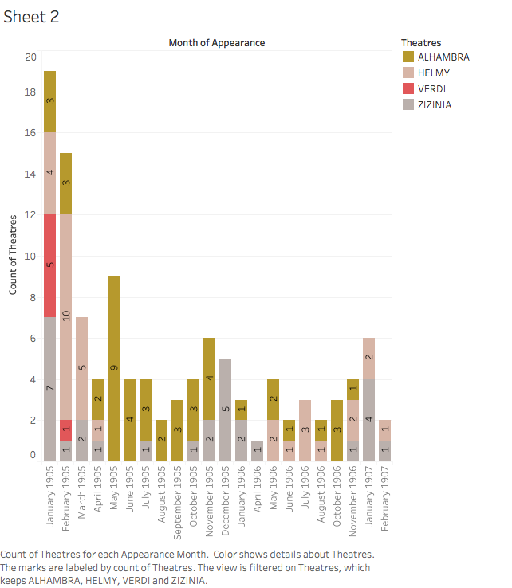

The  _Egyptian Gazette_ was a well-rounded newspaper containing topics varying from weather, plague, sports, and daily trade. There are so many topics covered, it was Egypt’s source of news in the early 20th century. While going through the newspaper, coding it, and reading the different stories, something stuck out to me. I was coding page four of my Monday issue when I read about a show within a small theatre in Egypt. This stimulated my interest in what shows were like in the 1900s compared to how they are now. With all the different events going on within the newspaper, there was a large emphasis on the arts, especially musical art and theatres. This was interesting to me because I was always around live shows growing up. I wanted to see how things were different over a hundred years ago in a different country than they are today as I know it. Also, I wanted to compare the theatres mentioned within the region the newspaper covered.

## Getting Acquainted

There are four prominent theatres that occur throughout the newspaper from the years 1905-1907, although there are more that show up. Most of the appearances from these theatres come during our winter months (December-March), I am assuming because that is when most of the shows happened. The four theatres that show up the most are the Zizinia Theatre, Verdi Theatre, Abbas Helmy Theatre, and the Alhambra Theatre. To look more in depth to these theatres I used the query, `//head[contains(., "THEATRE")]`. This searched all the headers containing the word theatre. The all caps were necessary because most of the headers coded for use all caps as the header and also used “Theatre” as a search to find the headers with lowercase letters. After gathering more and more information about what theatres were present and which ones appeared the most, I changed theatre to the different names of the specific theatre to narrow my search. The Zizinia and Alhambra theatre show up the majority of the time compared to the other two. Also, the Zizinia Theatre seems to be widely popular, and by far the most popular out of all of them based on the reporting on it. The Alhambra shows up the most number of times trhoughout the paper. The way these theatres worked was a company would rent out the theatre for a certain period of time and put on shows there. A lot of the time there were operas, but other shows range from dramas or comedies. The Verdi Theatre, for example, is a company and they rent out the Cairo Opera House to do their shows.

## Location

My first thought when reading into these different theatres was where they were located. I thought the location would give me more insight on how each one functioned, and I could draw my conclusions on the overall performance from there. To my surprise, the Zizinia Theatre, Abbas Helmy Theatre, and Alhambra Theatre are all located in Alexandria, while the Verdi Theatre location is in Cairo. Alexandria is on the coast, which means more people coming through the city such as tourists or just passing through. I think there is a greater demand for theatres in Alexandria because of this foot traffic. Cairo is also a large city in Egypt, but the demand for theatre is less there. The trend for this holds up in the actual stories of the newspaper.

## Verdi Theatre

The Verdi Theatre in Cairo struggled a lot during this time period, which surprised me because of the magnificent layout the Cairo Opera House was. The Khedive at the time wanted something superior to anything else, so the building cost a fortune, but was well constructed (LePaitre 1963). However, upon deeper research in the newspaper, reading what the editors wrote on the Verdi theatre, my opinion was quickly changed. On one occasion in the newspaper, an editor was begging the people of Cairo to go watch shows there. They said the theatre was empty and the companies did not want to rent it out anymore. At one point the Verdi Theatre even went on strike because of their struggles. There is never anything of this sort about the other theatres in Alexandria.

The struggling of the Verdi theatre intrigued me. They struggled at the beginning of 1905, as I was going down the dates, another event was interesting.

## Fire!

The Abbas Helmy Theatre caught on fire in April of 1905. No one was injured, but the whole theatre was destroyed, and this caused a few things to happen. After the sudden decline of Abbas Helmy, the Alhambra Theatre received a lot more coverage from the newspaper, and I think this gave them a lot more popularity. Towards the end of the content (around April 1907) there is reporting of the Alhmabra Theatre getting an upgrade. Another cause and effect was the emergence of a new theatre, the Ezbekieh Theatre. However, this new theatre was located in Cairo. This theatre was built next to the Ezbekieh Gardens, along with another theatre next to it. The Khedive made a lot of money by renting these theatres out to various European companies (Barbour 1935).

## Consistency
The most popular one, the Zizinia Theatre, had a wide variety of shows such as dramas, comedies, and even the occasional biblical one. For most of the two-year time period, they were occupied by French companies. The newspaper would always comment on how the audience reacted so fantastically to all of the plays at this place. Nothing ever negative was really written about them in the paper, the Zizinia seem like the perfect place to go watch a show. I read a journal review titled, “Alexandria: Its Town Planning Development” (Riad 1933) about the layout of Alexandria as a city and the different things going on within the city. The city seems very well put together. It has a wide variety of buildings and grew up on the Mediterranean Sea experiencing a lot of different cultures and travelers coming through. This gave them a diverse culture, as well as a diverse audience for their theatre shows.

#### Challenges

Researching this topic was very rewarding as I learned a lot, but it was very challenging at the same time. A lot of the items written about the theatres are repetitive, or not interesting. Since this is a day-to-day newspaper, not everything is exciting all the time. There are a lot of reports on these theatres giving an average show, they give how the audience reacts, and that is it. This repetition over the course of reading hundreds of items on four different theatres was tough. Another challenge I faced was the bias of the newspaper. News in the present day can be very biased and push the audience’s perspective in one way or the other. I am not sure if this is what was going on in the  _Egyptian Gazette_, or if they were factual and the Zizinia Theatre was really that amazing, or that the Verdi Theatre really struggled that much. The editors in the paper make it seem like nothing ever goes wrong at the Zizinia Theatre and it makes me wonder if this is just biased reporting because they favor the theatre, or if it was actually a fantastic place to go watch a show. Also, my sample size is only two years, between 1905-1907. During this time, certain theatres could have been thriving while others suffering, but before or after the dates the newspaper looks at, the roles could have been reversed.

#### Things Learned

Some of the things I learned in general were a lot of European and Middle Eastern companies rented out the theatres. At first thought, I would have expected other African companies to rent out the buildings, but after more thought and research this makes sense. Europe had just decolonized Africa, but this means a lot of European culture was still prevalent in Egypt. Another thing I learned was that there was a certain expectation for these shows. The way editors wrote about them, I could just feel the standard that was set. This leads me to believe that not only the theatre was prominent in Egypt, but the arts as a whole.

## Conclusion

If the reporting is factual, which I assume it is, the Zizinia Theatre is definitely the most popular. The Alhambra theatre shows up the most amount of times, and is also very popular. There are more theatres in Alexandria, and this make sense because of the population, and what that city has to offer. My focus of interest was on events at theatres, that were not actual shows in the theatre. The paper liked talking about these different events such as the strike at Verdi Theatre, the fire at Abbas Theatre. There are also other things mentioned in the paper not a part of the four prominent ones such as an attempted murder that was stopped by the audience, wrestling shows, and another strike. Overall, I think the theatre system back then was the same. In present day, there are more genres and of course more theatres in general. I think the talent level has also increased, with the more variety because actors are expected to be able to portray many different characters, sing, and dance. Whereas in this time period it seems like the level of ability consists of a few genres and mainly singing. However, for the early 20th century, I was impressed with the quality of shows produced and reported on in the Gazette.

## Sources
- Barbour, Nevill. “[The Arabic Theatre in Egypt](www.jstor.org/stable/608109).” _Bulletin of the School of Oriental Studies_, University of London, vol. 8, no. 1, 1935, pp. 173–187.
- LePaitre, George-Patrick. “[A History Teacher Visits the Cairo Opera](www.jstor.org/stable/3393642).” _Music Educators Journal_, vol. 49, no. 4, 1963, pp. 103–103.
- Riad, Mahmoud. “[Alexandria: Its Town Planning Development](www.jstor.org/stable/40101080).” _The Town Planning Review_, vol. 15, no. 4, 1933, pp. 233–248.
- “[Egyptian History 1215 CE](www.timemaps.com/history/egypt-1215ad/).” TimeMaps.
