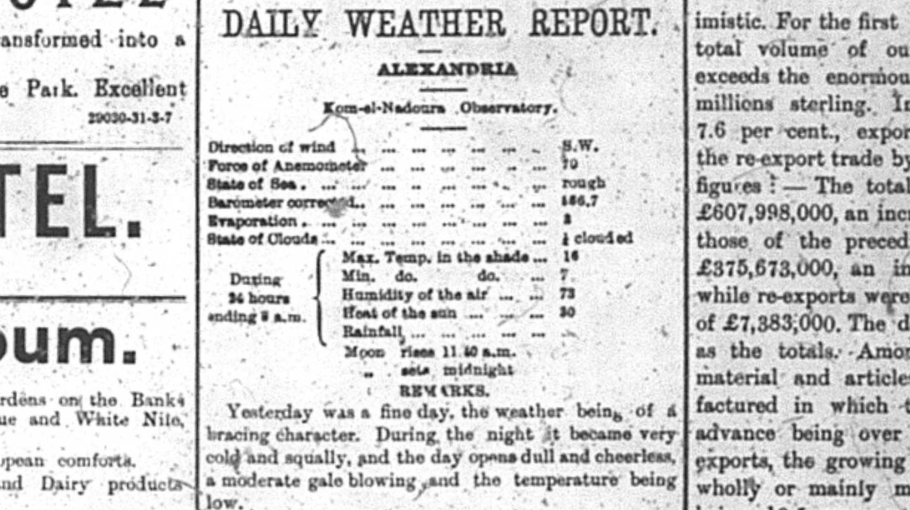

When looking back on Alexandria, Egypt over one-hundred years ago one would not expect much interest to be taken in the humidity in the day to day lives of the Alexandrians. In reality humidity could have an effect on how these Alexandrians functioned in their daily lives and caused different consequences on the city as a whole. Seemingly small things can be more impactful than as they appear on the surface. In this analysis project research was done to see how these Alexandrians could have been affected by humidity and what other consequences could have resulted due to high levels of humidity. The resource that was used to gather this information was from a microfilm version of The Egyptian Gazette. This was a British run newspaper in Alexandria, Egypt in the early 1900s when Egypt was still under British control. This means that some of the information in the newspaper could be skewed to make the British empire look better, so I chose to go with something that would be unbiased. In the newspaper there is a section called The Daily Weather Report which presents much information about the weather that the Alexandrians experienced on each day. The Daily Weather Report was found a page 2 in many of the editions of the newspaper. This was the main source of information used for the analysis project and the Xpath query I used was able to pull all of the data for humidity for each of these days in order to help further my work on the project. The Xpath query done in Oxygen XML editor was `//table[@xml:id="deg-ta-dawr01"]/row[6]cell[2]/measure[text()]` and it yielded 149 items which is a sufficient amount of data that could be analyzed and allow me to draw conclusions. Through conversations with class members I was able to find out more interesting facts about humidity. My classmates helped me to become more aware of the health effects of humidity on the human body, so I used their knowledge to investigate on the web. The information found in The Daily Weather Report was useful to Alexandrians in the past, but now it is also useful for todays weather experts in order to compare it to the present to see changes in climate and also to see what kind of health conditions these Alexandrians may have been experiencing.

When trying to decide what to write about for the analysis project humidity was something that came to mind for me because it seems very relevant when studying microhistory to study something that many others would consider such a minor detail to observe, but is very interesting and thought provoking to fellow microhistorical researchers. Weather is fascinating to me so I figured it would be best to pick one aspect of weather to focus on in order to keep in tune with microhistory and what it studies. Microhistory studies small and miniscule things in order to bring everything back together and form a big picture about the past that can help gain much more understanding about how the world used to function and how the world has changed since that time. When looking at recorded health records at the time researchers can see at what times sickness was more prominent in Alexandria, Egypt and compare that to the humidity levels at that time of year. With this correlation now known it can be assumed that during the times when people were sick or suffered bad symptoms it could have affected Alexandrians workload. In order to further revise and improve what I have proposed I would have to try and make sure that all of the data inputted was recorded correctly in order to make sure that this information is reliable enough to make assumptions about past times.

When beginning my study into the humidity levels in Alexandria, Egypt I wanted to make sure that I would be able to find research on a topic in order to be able to apply what I found. I was able to find much information on medical websites to explain what high and low levels of humidity can do to the human body. Information about past humidity levels in Alexandria is important because it is important to see how the humidity levels have changed overtime in comparison to now because keeping track of climate is vital for future generations to come. The climate regulates how much work can be done and the health of the citizens in a specific area, while also regulating people’s moods and emotions. All of this information correlates together by deciding how productive a society can be at all times. Researchers all over the world try to further improve their knowledge on climate so that they can apply it to the society they are studying. Some of these studies reveal many results since their research may study outliers in the climate that they are studying, while many may not reveal much new information at all since what they are studying is too similar to recognize any drastic change showing results. Whatever the case all of this information can be looked at and stringently analyzed so that it can form a big picture when pulled back in with all other sorts of recorded and known information at the time.

A problem that may arise when studying these past climates is the technology that was being used to record this data. In the past technology was not as reliable as it is today, and this could mean that what was recorded in the past could have been wrong skewing the results and assumptions of past data on humidity. In order to improve research on this past information studies must be done to see how reliable this past technology was and compare it to what is being used today. It is a requirement to know how accurate this past technology was to ensure what is being researched is good enough to rely on. I’ve also wondered if the everyday Alexandrian understood what humidity levels meant and what effect it could have on their day in the past. If they did not seem to care it would give reason to believe that they may have recorded the humidity data less accurately since they did not really understand its importance at the time.

Humidity can have negative effects on human health when its levels rise too high or too low. At high humidity dehydration, fatigue, muscle cramps, heat exhaustion, fainting, and heat stroke can occur, while at low humidity people are more at risk of getting the cold, the flu, and other infections. This is according to UPMC Health Beat and SensorPush. With this information in mind it gives a better understanding of what effects humidity could have on the society. At this time in the past people were not afforded the ability to have fancy medical equipment and more informed doctors. This meant that people were slower to recover from an illness that they may have gotten from humidity levels, and lead to an increased chance of death and a decrease in the amount of work output in the community. When observing a single part of the weather it proves that something that may seem small can create a large and prominent effect on a city as a whole. Through studying this data researchers are better able to come up with ways to combat the harms of humidity on the human body and prepare future generations to stay healthy in order to create a healthy and efficient community. There is still so much that needs to be learned on information that may seem irrelevant, but in reality can play a huge role on peoples’ quality of lives.

The various graphs I created using Tableau produced some interesting results that helped to give me a better understanding of the data that I had collected. I preferred the graph that showed the average humidity for each month over the years of 1905-1907. The month that seemed to be the outlier overall was April in the year 1906. The average here was very different from other recorded months of April. I also made a graph of the average of each day over the year and encountered the problem of people not updating their Daily Weather Report section. I discovered this because there were multiple days in a row that had the same repeated value of 76 allowing me to determine that others had not correctly updated there tables to provide accurate data.

The main issue I encountered when performing the Xpath query and observing the results was that some people did not fill out the weather table correctly or did not input that information at all. My goal was to find data on humidity between the years 1905-1907, but when performing my query the vast majority of the data came from 1905 some from 1906 and a very miniscule amount from the year 1907. This means that my gathered information may not be as reliable as I would like it to be. From what I observed the majority of the data showed that the humidity levels were consistent between 70-90 percent. This did leave room for plenty of outliers with humidity in the high 90s on some days, while on others there was a definite drop in humidity. This shows how drastically the humidity could differ in the climate in Alexandria, Egypt. To put this information into perspective the ideal home humidity level is between 40 and 60 percent in order to maintain maximum comfort and healthy living conditions. This may differ outside but it still allows people to get a better understanding of what preferred conditions are like.

It is very intriguing to see how using technology now such as Oxygen XML Editor, Tableau, and Atom can take information from the past and create a much greater understanding of previously recorded information. New technology has created a great new platform to present information that in the past would be much more tedious and time consuming. With all of this gathered information researchers alike can present this information to keep societies growing with knowledge and to help improve the health and welfare of future generations to come.

Sources:
- https://share.upmc.com/2014/06/effects-humidity-body/
- http://www.sensorpush.com/articles/the-effects-of-low-humidity-on-your-health-and-comfort
- https://www.hvac.com/faq/recommended-humidity-level-home/
