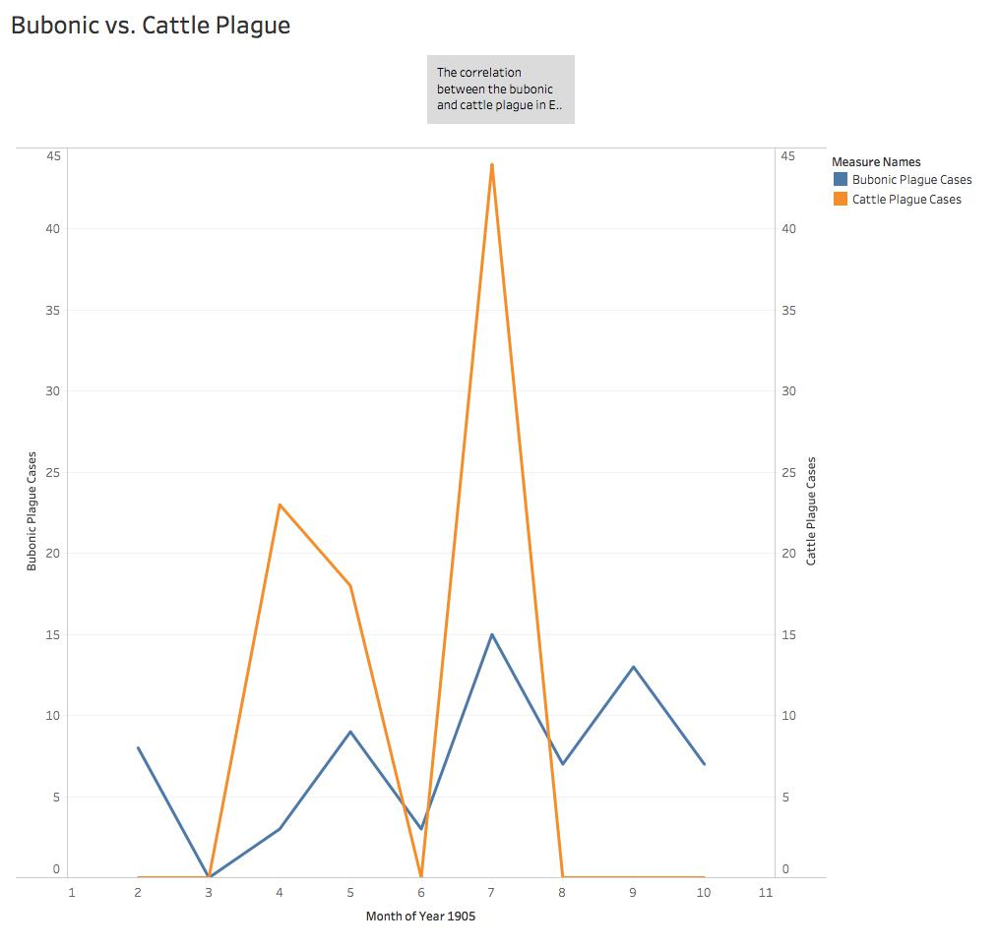

## Introduction
The  _Egyptian Gazette_ delves into detail about the plague and its various forms. The cattle and bubonic plague both created epidemics in Egypt especially from 1905 through 1907. The spread of the bubonic plague swept through Egypt during the early 1900s. Regions across the nation including districts of farms, small towns, hubs, and port cities were all infected by the mass illness. The epidemic did not only hurt the well-being of residents of Egypt, but it resulted in a change in agriculture, markets, the economy, and the habits of everyday life for the residents of Egypt.

## Gathering Data
The frequent articles under the “Local and General” section prompted me to discuss and analyze the different plagues in Egypt and how they correlate, if a correlation does exist. I began this analysis by first narrowing down the searches of the plague into a reasonable number of returns to search through. The query I used, `//div[@element="local"]/div[contains(.,"plague")]`, searched through the Local and General section of the _Egyptian Gazette_ for the keyword “plague”. This search came up with 133 results. I then organized these searches into three categories based on the most frequent words that came before the plague using the regular expression search of “\w+ plague”. The most frequent words used before the plague were the words “the”, “bubonic”, and “cattle” along with other variations of words that can be found in this word cloud.

While searching through the variations of word combinations with the plague, I noticed many of the results came from the same articles that used the word “plague” multiple times. Therefore, I changed my xpath query to `//div[@element="local"]/div[contains(.,"plague")]/head` to search only in the headings of the “Local and General” section. This search resulted in 47 queries with 31 results being “the plague”, 9 results being “cattle plague”, and 7 results being “bubonic plague”. From these headings, I was able to get a better understanding of the frequencies and dates of both plagues.

## Background
The bubonic plague epidemic began in the early 1900s with a sweeping illness that resulted in 843 cases of the plague in 1904 and 501 deaths as a result. Throughout Egypt, methods of preventing the plague and its spread began to arise to prevent further fatalities and sicknesses that occurred as a result of the plague. The most prominent reason why the plague was being so quickly and widely spread was because of the strong trading business that occurred in Egypt during the early 1900s. Top locations that showed the highest fatality and contractions of the bubonic plague typically incorporated port cities of Egypt and large hubs. Alexandria, Suez, and Port Said were some of the main cities that had the highest records of the bubonic plague in Egypt. As a result, beginning in 1905, cases of the bubonic plague struck Egypt and its citizens through contractions from other nations. The bubonic plague became a record-breaking epidemic in Egypt. The average rate of contracted illnesses that were a result of the plague was approximately 7 per week and approximately 4 deaths per week from the plague. Nations and regions including India and Upper Egypt have spread the disease through merchants and traded goods between the two locations. As distinguished by Sir H. Pinching and Dr. Cresswell the “infection conveyed …. had been infected themselves by goods coming from India or Upper Egypt”. Through the use and distribution of these goods the plague impacted many civilians such as one case in January of 1905 that caused the illness of fifteen people and three deaths caused by the bubonic plague. This resulted in a search and cleaning of multiple ships and shipments that may have been affected by the plague. Many ships were seized if they were found to have traces of the plague and taken into quarantine. The search and seizure of many ships that had goods that were impacted the plague also resulted in different maritime procedures and a delay in times for the passages of ships – resulting in delayed voyages and arrival of traded goods.

In addition to the bubonic plague, another form of plague quickly spread across Egypt as well. The cattle plague came across Egypt from Sudan and infected the cattle of Egypt and the produce market as well. The outbreak first came across Sudan and then impacted Egypt through imports from Sudan. The epidemic only affects cattle and cows directly and causes the death of these animals in large quantities. However, the cattle plague does affect humans indirectly also. The lack of cows leads to a lack of products that result from cattle causing a shift in the Egypt economy, market, and dietary habits of the people of Egypt. The cattle plague also affects the residents of Egypt since the consumption of milk and other products that originate from cattle may result in illnesses to the individual who has digested it. Although the cattle plague was still a significant epidemic in Egypt, it did not affect as many humans as the bubonic plague did. In two articles of the “ _Egyptian Gazette_” that discussed the cattle plague, readers can analyze how long the cattle plague was a significant epidemic in Egypt and surrounding regions. Articles from January of 1905 indicate that the cattle plague began in late 1903 and continued severely through the middle of 1905. Although, the cattle plague lasted until 1906 with scarce and spaced out incidences of cattle plague diagnoses. In 1904, 5,065 deaths in January were recorded as a result of the cattle plague. In 1905, the total cases reported in January of the cattle plague were 146,791. However, in 1905 measures to end the cattle plague began which resulted in less cases being reported and less fatalities as a result of the cattle plague. One measure taken in order to end the plague was having the cattle being treated with vaccinations to immune them from the illness. In the same time period in 1905, 884 animals were treated with the vaccine. The treatment of animals to prevent the cattle plague overall worked in certain regions in Egypt. In 1906, the cases per week shifted from hundreds of reported diagnoses into an average of 3 per week in May. However, as certain regions became clear of the epidemic, other regions began to break out in the epidemic if the government did not choose to prevent the plague before it arrived.

## Data Analysis
For both the bubonic and cattle plague, the peak season for cases was during the summer months of 1905. The two peaks for each type of the plague were in July. However, the bubonic and cattle plague have no direct correlation to each other as represented by the data from the reports of the  _Egyptian Gazette_. The graph depicted below shows the correlation between the bubonic and cattle plague in Egypt and how they have similarities in ranges but no direct correlation. If there were a direct correlation, the peaks of both lines in the graphs would have been more in sync that they currently appear to be.

## Conclusion
The analysis of the plague in Egypt through the articles of the _Egyptian Gazette_ was useful since it offered a direct source of the plague and its effects of the people of Egypt. However, varying sources of information from a different lens would have also been useful in addition to the newspaper. Since the _Egyptian Gazette_ typically holds the lens of a journalist to inform readers, other point of views that could have been vital to an analysis of the plague of Egypt could have been those found in a medical examination or historical research paper. Additionally, because this is a form of micro-history dating back to a century ago, some data may have misprinted or lost while creating the microforms of the _Egyptian Gazette_. Such information may have improved my analysis since there are months without updates of the plague that may have skewed results found.

## Links
- [The Ten Plagues ](https://www.chabad.org/library/article_cdo/aid/1653/jewish/The-Ten-Plagues.htm)
- [Plague in Egypt](https://www.ncbi.nlm.nih.gov/pmc/articles/PMC4506964/)
- [Plagues, Epidemics, and their Social and Economic Impact](http://www.ccsenet.org/journal/index.php/ach/article/view/23836)
