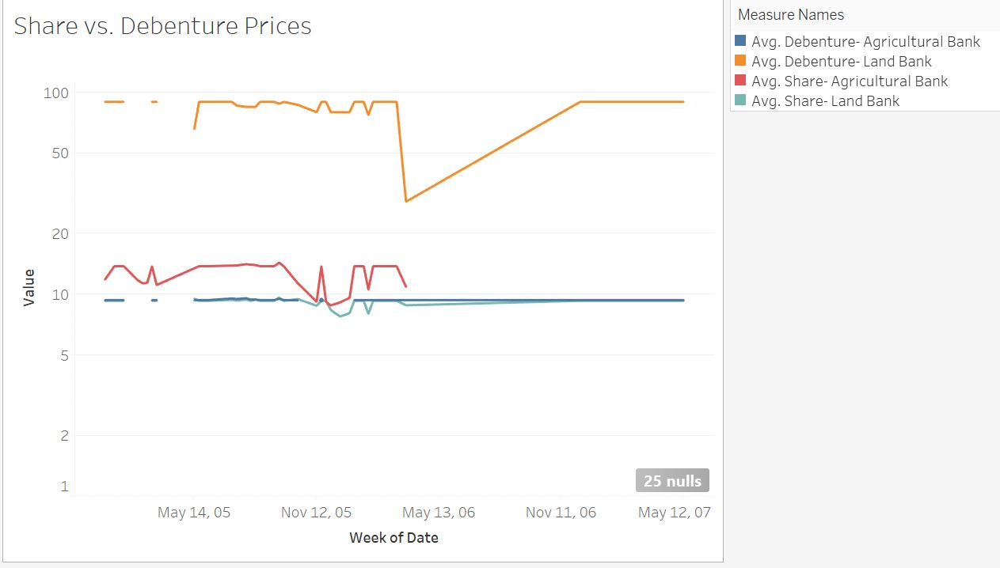

Expanding on my blog post “Is Egypt In a Bubble?,” I dug through the pages of the _Egyptian Gazette_ and traced the “Stocks and Shares” table throughout 1905 and 1906 with as much data available from 1907 as well.  

This table listed the stock with its stock price as well as its debenture price. A [stock]( https://www.google.com/search?q=define+a+share+of+stock&oq=define+a+share&aqs=chrome.2.69i57j0l5.5922j1j4&sourceid=chrome&ie=UTF-8 ) is a portion of company ownership that is sold to the public for which the owner of the stock receives a part of said company’s earnings. A [debenture]( https://www.google.com/search?ei=Ky7eWu2DL4WSzwL2_7T4Ag&q=define+a+debenture&oq=define+a+debenture&gs_l=psy-ab.3..0j0i22i30k1l9.6015.6015.0.6450.1.1.0.0.0.0.114.114.0j1.1.0....0...1.1.64.psy-ab..0.1.112....0.t1UcNE-Mr5I), is similar to a stock, but instead of the value of the stock rising and falling with the company’s wealth, it has a fixed rate of return.

The point of this project was to not only compare the stock price and debenture price of any given investment over time but also to compare both a “gilt edged” investment, meaning a strong investment, to one that may have been suffering in the oncoming financial crisis in Egypt at this time period (as explained in my [blog post](https://dig-eg-gaz.github.io/curiosities/metallo-is-egypt-in-a-bubble/)).

What spurred this investigation were the parallels that I was seeing between the Great Recession of 2008 in the US and the articles written about the Egyptian economy in 1907.  It is true that markets are cyclical and have their ups and downs. For the most part, we can see these cyclical trends coming every 10 or so years. This would mean that exactly a decade before the US market 2008, Egypt would have been feeling the sting of an economic crisis similar to that of the one the US experienced.

When searching for information on the Egyptian market failures of 1907, the Panic of 1907, also called the Knickerbocker Crisis, kept appearing as a result of my searches. The Knickerbocker Crisis was a US Stock market dip that occurred in October of 1907 and the effects of this crash were not limited to the US as explained [here]( http://www.jstor.org/stable/2141305?Search=yes&resultItemClick=true&searchText=panic&searchText=of&searchText=1907&searchUri=%2Faction%2FdoBasicSearch%3FQuery%3Dpanic%2Bof%2B1907).

Tracing the financial articles throughout the _Egyptian Gazette_, and as noted in my blog post, it is clear that Egypt felt their economy failing and very quickly what was a “localized” crisis began to spread:

Soon after, the crisis was felt abroad, as seen in the article below from the introduction to a quote of a French article. Not only is the crisis officially “raging” in Egypt but is felt all over Europe (which, honestly, has the most to lose seeing as Egypt was still under European rule).

.

Below is the visualization of the results from tracing the “Stocks and Shares” table in the _Egyptian Gazette_.  The strong stock that was analyzed was The Agricultural Bank of Egypt and the stock that was supposedly losing traction in the market was the Land Bank of Egypt. This is not unlike what most consider the cause of the US Great Recession of 2008 and many other economic recessions throughout history, speculation, in particular land speculation ([or in 2008 the bundling of blatantly faulty mortgages]( http://www.jstor.org/stable/43189952?Search=yes&resultItemClick=true&searchText=great&searchText=recession&searchUri=%2Faction%2FdoBasicSearch%3FQuery%3Dgreat%2Brecession%26amp%3Bfilter%3D)).

From this visualization, it is evident, in a loose pattern, that the share and debenture prices seem to mirror each other. It seems, by this visualization, that the Land Bank of Egypt outperformed the Agricultural Bank of Egypt which is the opposite of what is expected given the information found in the financial articles of the _Egyptian Gazette_. As to why the debenture price of the Land Bank was so much higher in general than the other measure, I cannot say.  This could be due to improper coding of the Gazette or some other underlying force at the time. To speak to the stability of the investments, the only one that seemed to be unwavering was the debenture price of the Agricultural Bank which we would expect from a “gilt edged” security. The share price of the same investment does not stay as steady but is still much more constant than the Land Bank debenture price.
