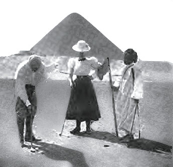

Golf in today’s day in age has come a long way since it was invented in the 19th century. The technology, how it is played, taught and how it is treated at country clubs. There were country clubs that had golf courses in the beginning of the 20th century around the word but the clubs didn’t usually revolve around the golf courses rather than the typical “sporting” club games such as croquet and other games played on nice grass surfaces. Golf has come a long way but it still was more popular in Egypt than most would assume in the beginning of the 20th century. The picture below was one of the first images that showed the initial relevance to golf in Egypt, it was taken at the Mena Club in Egypt and adds a bit of relevance to when golf started up in Egypt when this picture was posted in a golf magazine in 1898.

Golf was invented in the UK in the 19th century and didn’t really become a popular sport around the globe til the 20th century. The English and the Scottish were the innovators of golf around the world because nobody knew about it until they began to share it with other countries, according to [Places-Golf in Egypt](https://www.antiquegolfscotland.com/history.php3?itemid=77). In Egypt in 1905, there were country clubs that had golf courses but most of the clubs where golf was popular there seemed to be a large influence of it from English members. For example, in March of 1905 the Suez Golf Club registered a tournament for the members to play in and over half of the contestants were English which shows much influence from them. However, as years went on, golf seemed to become more popular to the Egyptians most likely because of the English and Scottish influence that was relevant in Egypt.

Golf tournaments in Egypt in 1905-1907 were much different than they are today around the world. After searching "golf tournaments" in the sport and play section in xml I found results from a couple tournaments and the formats of the tournaments were different from most of the tournaments in today's day in age. This is most likely because of how golf was still a new game and people were still trying to learn how the game was played. The format of most of the tournaments I have read about in the beginning of the 20th century were different from what they are played around the world today. They were played in a “match-play” format rather than a “stroke-play” format like in today’s society. The format of match play is played on a hole by hole basis and is played in a “one vs. one” format. One person plays another and the score from each hole can result in 3 different outcomes; a win, loss or tie. Each hole is worth one essentially in the match and whoever has won the most holes after the conclusion of 18 holes has won the match. Stroke play in today’s day in age is much different because it is based upon a player’s total score over the course of 18 holes and is not played in “one vs one” format rather than a full field of however many players play and whoever has the lowest total score is the champion. Tournaments were played like this most likely because it is more enjoyable and an easier way to keep score against your opponents; it also makes the round of golf take a shorter amount of time and is a much easier way to play for those who aren’t as skilled as golfers are today. After analyzing much of the country club tournaments they are all played in a handicap format as well which is a way a less-skilled golfer can play a better player in a fair format. Handicap is based upon your average score from previous rounds and for those that are less skilled playing a higher skilled player gives them a “handicap” so they can compete fairly. Once again, this makes it more enjoyable for golfers of all skill levels to have a competitive match against anybody. The Suez Golf Club had two tournaments every month for their members; a bogey play tournament and a match play tournament. I configured this information from xml by searching for "golf clubs" in divisions and finding a sport and play section talking about the Suez Golf Club on October 18, 1905. A bogey play tournament is a format that is not common whatsoever now but was probably a more enjoyable way for those of less-skill level to enjoy competition. The tournaments in Egypt in the beginning of the 20th century were all ran by country and sporting clubs and took time to play. Since match play tournaments are played “one vs one” there were more rounds of golf to be played and this was in the form of a bracket. Therefore, these tournaments would take weeks to complete and those who lost a match would be immediately disqualified from the tournament because they would be knocked out of the bracket. Tournaments now are ran by organizations are much more competitive than they were over 100 years ago mainly because of the popularity of the sport. There was a tournament at Alexandria Sporting Club that included 3 different formats: match play, foursomes and stroke play. The championship format was match play in which M. Logan won 3 up with 2 holes to play. M. Logan also competed in the foursome format which is a 2 vs 2 format and won that to add another tournament title to his record. This information was found by searching "golf tournaments in Egypt" and was found on the date of February 14, 1906 in xml. The results are posted below.

After reading about the organization of the golf clubs, all members who wish to play in tournaments and register their handicaps are to report to a golf steward of each club. The golf steward is one who runs all the tournaments and puts them together. The steward is similar to what the Head Golf professional of each country club today does; they essentially run all of the golf operations and put everything together for the members. The golf steward of some clubs such as the Suez golf club would give lessons just as a professional at a club now a days does. This aspect of the organization of golf at clubs is more similar than I first suspected. The official definition of a steward is “an official appointed to supervise arrangements or keep order at a large public event.”

On June 26, 1905, the _Egyptian Gazette_ posted an article labeled “Vardon on Golf”. Harry Vardon was one of the most accomplished golfers in the world at the time and in the article Vardon talks about tips of how to play the game and what accounts to the success of very good golfers. This article being published shows that golf was becoming more popular since there was a very long and detailed article on the front page of Egypt’s most popular newspaper. The article also mentions results from the Open Championship which is golf’s most historic golf tournament. Harry Vardon was English and this article transpires back to the fact of how the English made golf in Egypt a relevant and popular sport.

When looking for tournament results in years 1905-1907 I only came across of 3 golf tournaments which showed that official tournaments weren’t very popular but also meant that they were significant. Three different clubs held golf tournaments and each tournament had a different outcome. The winner of each tournament did not win by very much meaning there was stiff competition but the winner at Suez Golf Club won by the largest amount which can be inferred that he was probably the best golfer of the three winners and out of all the tournaments. There was just a punctuation for his first name but his name was N. Worthy and he won by the most holes. This is significant because it showed who was the best golfer at the time in Egypt who played in these tournaments. The results are in the chart below.

Since there weren’t an overwhelming amount of clubs in Egypt in the early 20th century, I figured it would be important to display which clubs there were and what each club had to offer besides golf courses. Country clubs now a days usually have a lot more activities than just golf and so did they back in the 20th century, they often had many games played on manicured grass surfaces. The main sports and activities that the clubs had to offer included golf as the main sport, horse racing, tennis, bowling, croquet and soccer. There were a total of 6 popular country clubs in Egypt at this time and also a few sporting clubs. Every country club had a golf course which shows that golf was a up and coming sport throughout Egypt. However, some clubs didn’t have the stereotypical 18 hole golf courses. Some had 12 hole and 9 hole courses which shows that golf wasn’t the most popular sport at the club but they still had it because it was an up-and coming sport. Croquet was the 2nd most popular activity at the clubs.

Golf has shown to be an up and coming sport in the early 20th century in Egypt and provided more influence in the sports world than most people would think. However, it is still very different than what it is today. Almost every aspect of different types of golf and how it's play has evolved which is what sports are supposed to do over time. Golf in Egypt still isn't very popular to this day but it still is relevant thanks to the English and Scottish that brought it over in the early 20th century.
