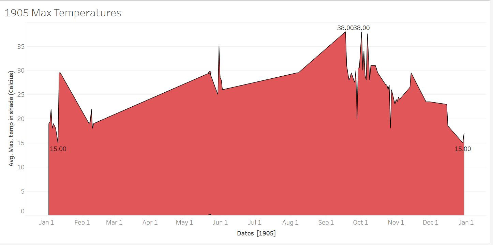

The climate in Alexandria, Egypt has always been unconditionally hot.  The _Egyptian Gazette_ from the early 1900s provided daily weather reports in  their weekly issues. This newspaper also referenced the many ways the population  escaped from the dreadful summer months. Although Alexandria is still a highly  populated city, the booming city from the early 1900s was filled with many  immigrants. Even though Alexandria is close to the Mediterranean Sea, the  western desert provides much of that dry heat to Alexandria. Many citizens  escaped the heat by going somewhere cool back in Europe.

The heat gave the residents no relief, even at night. Without modern day technology how did the residents survive? We may also ask ourselves now, was the temperature a factor in activities in Egypt? If an average spring day in Alexandria hit a temperature of 29 degrees Celsius (84* Fahrenheit) in the shade, how hot did it actually get?

The *Daily Weather Report* from the _Egyptian Gazette_ highlighted the different observed temperatures and conditions throughout different locations around Egypt. The *Daily Weather Report* also recorded the moon phases and other station's conditions. All these values are published in the _Egyptian Gazette_ once or twice a week. To extract all of Alexandria's temperatures, I searched through working sets and got the query:  //table[@xml:id="AlexandriaWeather"]/row[contains(.,'Max')]/cell[3]/measure to get 1905 daily max. temperatures from Alexandria's observations.![Max. temperatures from  1905].

Then I did the query `//table[@xml:id="deg-ta-dawr01"]/row[contains(.,'Max')]/cell[3]/measure/text()` to get the data from 1906 and 1907, since it used a different template.

This query helped me draw a relationship between the weather temperatures were livable conditions to survive without the technology we have now. The graph I produced from the query shows recorded temperatures around Alexandria. Alexandria's average temperature mean was 25.81* Celsius or 78.5 degrees Fahrenheit. The coldest temperature is even higher than the average temperature for Earth (57*). These temperatures demonstrate that the climate was much warmer than many other habitable places in the world.

The seasons in Egypt are quite minimal. Alexandria is close to the coast so they tend to have a higher humidity than the surrounding desert. Since it is hot all year around, and many people escaped the heat in the summer. Especially the British who were not used to the heat, since the UK has a maritime climate. Winter and summer align with the U.S., since Alexandria is in the northern hemisphere, but Egypt's location is an important part of the heat they receive.

Besides the abnormally warm temperatures, precipitation is also an important factor for the climate. Alexandria tends to have a higher amount of precipitation than the majority of Egypt, but rain has always been very minimal to around a maximum average of 200 mm a year. Although Alexandria is close to the Mediterranean sea, the water was not sufficient to drink, nor did they have the proper technology to extract the water for drinking. This means they had to transport most of their water from the Nile. Besides water, shelter is also very important for living. Homes and businesses were built from stone and clay which are materials that help keep the area cooler. Since refrigerators and air- conditioning were not yet accessible during this time, citizens probably had a harder time cooling off during the summer months. Hence, why the wealthier population tended to leave during the summer months.

The results I received from my data can be conclusive. The average temperature was 25.81*, while the high and low temperatures were 39* and 10.5*. This means that the temperatures were 102.2* and 50.9* in Fahrenheit, giving the average to be. A few data points were taken out of the graph due to being outliers. The first outlying point was a mistake in the _Egyptian Gazette_. The printed high temperature in the shade displayed on the issue from March 5th 1906, said it was 7.5*. This can only be a mistake considering below it says the low temperature was 11.3*. Therefore the point was taken out. seventy-six other values were also extracted due to the inaccuracy of duplicating the template.

These temperatures recorded would make it hard to live in especially within the summer months. Without proper electricity and water, Alexandria would be a hard environment to live in. Combining the results of the data with the knowledge of technology and resources, Alexandria was most likely a difficult place to live. The harsh climactic conditions could have contributed to a decline in population after the early 1900s. While many of the people who grew up in Alexandria were used to the climate, Europeans who immigrated there could have had a much harder time adjusting. Although the climate in Alexandria, Egypt was much harder to live in, it doesn't mean it was unlivable for the early 1900s. The high temperatures and lack of rainfall would make it harder for farmers and the rest of the working class but overall the climate could be deemed acceptable, especially for the wealthy.
