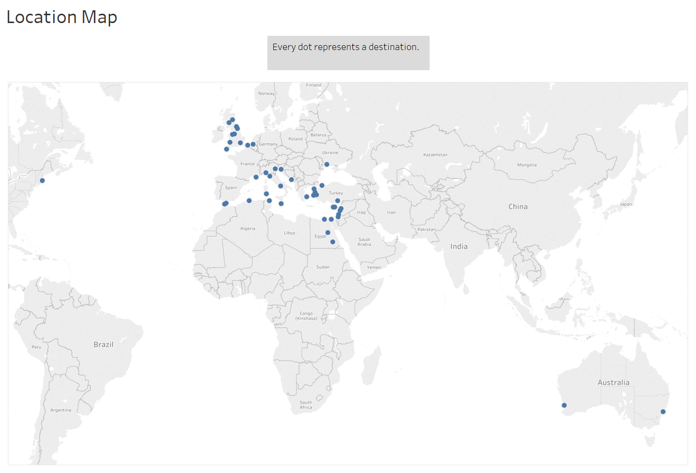
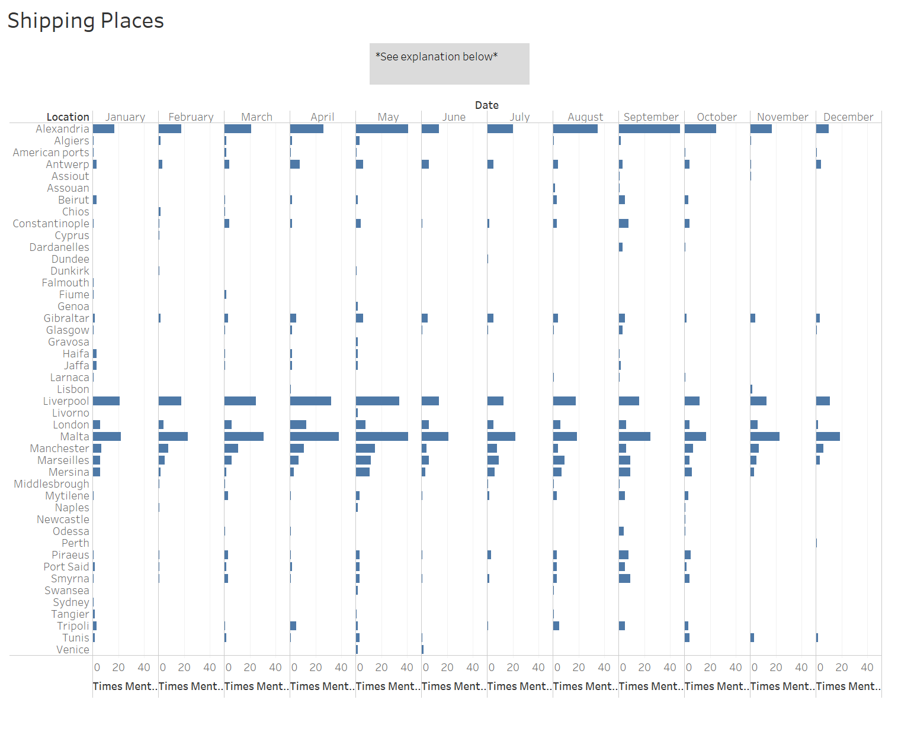

## The Brainstorm
The world in the twenty first century is one that is connected, by the internet, but also by the seas. As Michael B. Miller said in his book, Europe and the Maritime World: A Twentieth Century History, that “commercial maritime world helped to shape the modern world’s organization of consumption and production”. The topic of how shipping works and how it affected the world then is in reality, a study of how our world has came to be. The world economy is driven in part by the movement of goods across large bodies of water. The twentieth century was no different as this is when shipping people and goods became something that a middle class person could do. As someone with a minor in geography, how people interact with others on a global scale is of great interest to me. When I learned we would be doing a project such as this in the class I knew I wanted to do something with the globalization of trade. This is the era of the steamship, as shown by the plethora of ads showing off the prices of travel. The steamship revolutionized global trade as it opened up new trade routes that were previously unavailable due to wind patterns. As it is quite obvious how important these steamers are, that raises new questions. Where are these ships going and when? What is on these ships, people or cargo, or both? Did the proportion of ships with humans versus cargo change throughout the years? What about the overall volume of ships going back and forth, did that change? These questions are the ones that this analysis seeks to answer. This is a history class, in part at least, and this microhistory blends well into the overall fabric of industrialization of the twentieth century. Each ship makes up a tiny story in the sea of history (pun intended).

## Background Information
In order to get this raw data in the first place, my fellow classmates had to use Microfilm which possessed the _Egyptian Gazette_ on it. We all collectively have scanned this newspaper using microfilm machines, specifically the ScanPro 2000. A very tedious process begun after scanning this pages, because it was necessary to split the page into fourths in order to get better image quality. You then had to stitch up these fourths into one image again so that you could finally OCR (program that allows you to scan an image and convert it into text). This is the graft that a microhistorian has to do in order to get the historical information.

## Serial Question
All of the questions listed above are relatively specific, considering the scope of the source material. This topic though can be pulled back a bit to find something that can be applied more generally. My goal is to learn how shipping from and to Egypt changed over the three year period in which the _Egyptian Gazette_ is available for research. Unfortunately the findings of this study can't be too intensely generalized to the shipping world in general because of the scope of the _Egyptian Gazette_. In light of all of this, I arrived at the question of “What is the usage and frequency change in shipping in 1905-1097 Egypt as represented by the _Egyptian Gazette_?”.

## XPATH Query
In order to search the full contents of the _Egyptian Gazette_, a Xpath query had to be formulated. This allowed the total contents of the newspaper to be searched in its entirety from 1905 to 1907. This XML search needs two things to be successful, a where and what.

### What
The "what" was relatively easy, find anything to do with ships right? No, because that gets every ad and listing in the paper, which there are many. The search needed to be refined, so the "what" changed to "shipping" instead of "ship". This still wasn't good enough to be used in any substantial way. Finally the solution was found, the xml id for a section of the paper called "shipping movements".

### Where
The xml id of shipping movements made the where easy, I just then needed to get the content out of the division. This was done by searching for every paragraph inside of the feature "shipping movements" by using the query of `//div[@feature="steamerMovements"]//p`. I collected the data after updating the working sets to the most current pages. This was done on Wednesday, March 28th.

## Challenges
Not all of the sections that were pulled for research were OCR'd correctly so they had to be either corrected by hand if they could be figured out what they were supposed to say, or they had to be deleted if they were too poor to even guess. Often times place names, one of the essential parts of the question, were incomplete or misspelled. There would be awkward spacing or formatting issues, as well as sometimes where the section would be the same for a couple days, showing that a person most likely copy and pasted the same template from either their own issue or from someone else for several days and didn't bother to change the values and content to reflect what the their specific issue said. There is a big possibility for missing out on many instances of the section if people don't use the xml id, as this is the hinge that holds this search together. The actual extracting of the data from the sentences were no easy feat either. Regular expressions were able to help but copious amounts of effort was put into getting the data by hand.

## Results
From the Xpath query, there were 698 instances where the xml id for "shipping movements" were used. Each paragraph contains a listing of the name of the ship, usually the company, where its going/when its getting to Egypt, the date of arrival, and what they had on board the ship either people, cargo, or both. Sometimes the ship will list some specifics of what cargo they were carrying, listing the amount with its unit measurement ex. (1000 bales cotton).

## Visualization
In order to better visualize the data, a word cloud was created in order to display the frequency of destination to and from Egypt. The bigger the word, the more often it occurred in the text.

Interestingly enough, looking at the hard data, the top ten is as follows, with number of occurrences provided,

1. 292	Malta
2. 273	Alexandria
3. 207	Liverpool
4. 85	Manchester
5. 74	Marseilles
6. 49	Antwerp

This is very interesting results on their own, but they will eventually contribute to a overall patch work of the wider question. One peculiar thing to come out of this search is the fact that Malta seems to be the top destination for ships to and from Egypt. Looking at bit deeper creates some doubt to the validity of this finding. Malta was very small with a tiny permanent population of people, how could they be the biggest trading partner for one of the biggest colonies of the British Empire? Looking even deeper into the actual text of the newspaper, often times the listings include that the ship will be going somewhere via Malta, probably due to its location in the Mediterranean. Malta is a good stopping point to restock and get ready for the second leg of their journey. Alexandria comes next in the list, most likely because that was the principle port for the Egyptian colony, even shipping to other parts of Egypt. The first real destination listed is Liverpool, this isn’t too surprising as it was one of the busiest shipping ports in the United Kingdom. Manchester is next on the list, as one of the first industrialized cities in the world, it possessed the need for raw cargo. This shipping route from Egypt helped supply this demand, and via the Liverpool and Manchester Railway, the two cities were incredibly connected economically as well as physically. In order to get a picture of the entire scale of this shipping operation, a map was created using the coordinates of each city to plot them geographically.

*Note: In the newspaper, all ports in the USA were listed as “American Ports”. The coordinates of Boston were used to represent all of these American Ports.*

There is three general regions to categorize the places in which these steamers were headed. The Mediterranean region,  the British Isles region, and the Far Reaches region. The first two are self explanatory, while the Far Reaches are used to categorize the ports in Australia and the US.

The steamers carried lots of things to and fro, but three main categories emerged in the newspaper, passengers, mails, and cargo. The cargo is further broken down into the types that were shipped.

*Note: The onions, cotton, timber, and coal are all part of the overall category of cargo, so they are included in the total number on the bar graph above.*

Cargo was the clear winner as one would expect, while passengers are second, followed by mails. Cotton was the most common type of cargo with coal coming after. This graph however does not allow for comparison over time because of the lack of data in 1906 to a degree and especially 1907. Smaller intervals of time have to be used to compare.

This graph shows that there is a pretty constant level across all three categories until you reach the third quarter where there is a jump in mails while passengers and cargo rise but not to the same degree. This makes sense as the third quarter is the ending of the summer months and the fall, a time of year where many crops were harvested. Cotton is a good example of this, as it rises significantly in the fourth quarter. After all the harvesting and processing were done, they were able to be shipped out.

In order to look at the change in place over time, a bar graph was made, plotting by month. The findings of this graph make sense with the other evidence that’s been presented so far. The summer months have a lull as people left Egypt to escape the summer as well as a lack of significant crops to be harvested during the summer months. The fall and early winter months have a flurry of activity of cargo shipping and people coming back after the hot summer.

## Conclusion
In asking the question about shipping, valuable trinkets of information can be gleaned from the data. The main port cities that Egyptian steamers shipped to and from like Liverpool, Manchester, London, Marseilles, Mersina, etc. This reinforces the current ideas about British shipping, using it mostly for self production but then also selling goods on the world stage. As for the change in cargo specifically, we are able to track not only when the Nile floods but also when summer is by deriving patterns. The Nile flooded during the summer and cotton was planted, and then harvested in the fall/winter months. Passengers rose and fell with the coming and going of the summer months.

All in all, this data turns out to be basically what you would expect. This window into the past was very enlightening and I’m glad I had the opportunity to conduct microhistorical research. I would hope however that a student down the line can polish up my data and go further once 1906 is complete and 1907 has some meaningful data. My methodology was strong but the lack of substantial data over a longer period hindered my results. The biggest hurdle was trying to extract the data that was needed out from the sentences, and the next scholar to try and tackle this question, I implore you to find a better pattern than I did.

## Works Cited
Michael B. Miller, _Europe and the Maritime World: A Twentieth Century History_. New York: Cambridge University Press, 2012.
